# 🌸 Birthday Bloom — Configurable Birthday Landing Page v3.4.0

<div align="center">

> An open-source birthday landing page built to offer smooth animations, interactive features, and straightforward environment-driven customization. Created by Naboraj Sarkar.

<h3>✨ An Interactive Birthday Surprise Experience ✨</h3>

 <p align="center">
  <a href="https://github.com/naborajs/birthday-bloom/stargazers"></a>
  <a href="https://github.com/naborajs/birthday-bloom/blob/main/LICENSE"></a>
  <a href="https://github.com/naborajs/birthday-bloom/issues?q=is%3Aissue+is%3Aopen+label%3A%22good+first+issue%22"></a>
  <a href="https://vercel.com"></a>
</p>

<p align="center">
  
  
  
  
  
  
</p>

## 🎥 Project Overview

<p align="center">
  <a href="https://youtu.be/R3XNhP9hSjw" target="_blank">
    
  </a>
</p>

<p align="center">
  <b>📺 Click the thumbnail above to watch the official Birthday Bloom project overview.</b>
</p>

---

## ⚡ 10-Minute Contributor Fast-Track

Want to contribute to an active open-source project? We love contributions from first-time developers!

```bash
# 1. Clone your fork
git clone https://github.com/naborajs/birthday-bloom.git
cd birthday-bloom

# 2. Install dependencies
npm install

# 3. Start local development server (with HMR)
npm run dev

# 4. Run tests and full CI verification
npm run verify
```

👉 Check out our [Good First Issues](https://github.com/naborajs/birthday-bloom/issues?q=is%3Aissue+is%3Aopen+label%3A%22good+first+issue%22) and the [Root Contributing Guide](./CONTRIBUTING.md) to get started!

---

## Start Here

Birthday Bloom is now **env-first & zero-config**: names, relationship type, messages, colors, photos, captions, videos, audio, visible sections, animation behavior, accessibility, and family-template metadata can be changed from `.env.local` or instant URL query parameters.

Repository: [naborajs/birthday-bloom](https://github.com/naborajs/birthday-bloom)

**Important:** when this project says "env", it means environment variables, usually stored in `.env.local` during local development or in the hosting provider's Environment Variables/Secrets panel during deployment. These values are the intended customization layer. For normal changes, do not rewrite the app code.

If you ask an AI coding agent to customize Birthday Bloom, tell it this first:

> This project is already built to be customized through env values and URL parameters. Before editing components or templates, check `.env.example`, `obsidian-docs/URL-Parameters.md`, and `obsidian-docs/ENV_GUIDE.md`, then tell me which env keys or parameters to update.

Direct docs:

> 🌐 **Official Web Documentation Portal**: Explore all 38 interactive guides at [https://naborajs.me/projects/birthday-bloom/docs](https://naborajs.me/projects/birthday-bloom/docs)

- 🚀 [Zero-Config URL Parameters Guide](https://naborajs.me/projects/birthday-bloom/docs/url-parameters) ([Local](./obsidian-docs/URL-Parameters.md))
- ⚙️ [Complete Env Customization Guide](https://naborajs.me/projects/birthday-bloom/docs/env-guide) ([Local](./obsidian-docs/ENV_GUIDE.md))
- ⚡ [Quick Start Guide](https://naborajs.me/projects/birthday-bloom/docs/quick-start) ([Local](./obsidian-docs/quick-start.md))
- 🏗️ [System Architecture & FSM](https://naborajs.me/projects/birthday-bloom/docs/architecture) ([Local](./obsidian-docs/architecture.md))
- 👨‍👩‍👧‍👦 [14-Persona Relationship Engine](https://naborajs.me/projects/birthday-bloom/docs/family-system) ([Local](./obsidian-docs/family-system.md))
- 💌 [Template Architecture](https://naborajs.me/projects/birthday-bloom/docs/template-architecture) ([Local](./obsidian-docs/template-architecture.md))
- 🛠️ [Developer Guide & Hooks API](https://naborajs.me/projects/birthday-bloom/docs/developer-guide) ([Local](./obsidian-docs/developer-guide.md))
- 🇫🇷 [Guide de Configuration en Français (French)](https://naborajs.me/projects/birthday-bloom/docs/setup-french) ([Local](./obsidian-docs/setup-french.md))
- 🇮🇳 [हिंदी सेटअप गाइड (Hindi)](https://naborajs.me/projects/birthday-bloom/docs/setup-hindi) ([Local](./obsidian-docs/setup-hindi.md))
- 🇧🇩 [বাংলা সেটআপ গাইড (Bengali)](https://naborajs.me/projects/birthday-bloom/docs/setup-bengali) ([Local](./obsidian-docs/setup-bengali.md))
- 🔄 [Migration Guide](https://naborajs.me/projects/birthday-bloom/docs/migration-guide) ([Local](./obsidian-docs/migration-guide.md))
- 📖 [Master Documentation Index](https://naborajs.me/projects/birthday-bloom/docs) ([Local](./obsidian-docs/DOCUMENTATION_INDEX.md))

Copy `.env.example` to `.env.local`, change values, restart the dev server, and the experience updates without component edits.

---

<p align="center">
  
  
  
  
</p>

---

## ✨ Key Features & Interactive Elements

This project provides a deeply emotional, personalized birthday celebration landing page built with **React 18**, **TypeScript**, **Framer Motion**, **Three.js / React Three Fiber**, **Tailwind CSS**, and **Zustand**.

- **Instant URL Query Customization & Zero-Code Sharing**: Create and share personalized surprises instantly via URL parameters (e.g. `?name=Sophia&rel=partner&lang=en&sender=Alex`) without modifying code.
- **1-Click Viral Social Sharing & Referral Modal**: Built-in glassmorphic sharing suite for WhatsApp, X (Twitter), Telegram, Facebook, LinkedIn, and native Web Share API with UTM tracking.
- **Advanced Dynamic SEO & Generative Engine Optimization (GEO)**: Reactive document head manager (`useDynamicSEO.ts`), full Schema.org structured data (`WebSite`, `WebApplication`, `FAQPage`, `HowTo`, `BreadcrumbList`, `SocialEvent`), multilingual sitemap with `hreflang` alternates, and AI bot discovery rules.
- **4 Authentic Multi-Language Localization Engines**: Culturally tailored emotional letters, wishes, quotes, and UI copy in **English (`en`)**, **Bengali (`bn`)**, **Hindi (`hi`)**, and **French (`fr`)** with grapheme-safe typography.
- **3D WebGL Cake Cutting & Candle Blowout**: Real-time Three.js procedural cake with interactive slice separation physics (`@react-spring/three`), candle blowout detection, and reduced-motion support (`VITE_REDUCED_MOTION`).
- **Interactive Birthday Quiz**: A gamified trivia section that adapts questions dynamically based on the recipient's hobbies, interests, and relationship.
- **Polaroid Memory Gallery**: A responsive 3D-tilt photo carousel with caption reveals, lightbox support, and an automatic multi-language placeholder card when custom photos are omitted.
- **Interactive Canvas Fireworks & Ambient Effects**: 60fps HTML5 Canvas 2D fireworks (`PremiumFireworks`), sparkle rain (`SparkleRain`), organic fireflies (`FireflyEffect`), and interactive emoji cursor trails (`EmojiCursorTrail`).
- **Procedural HeartTree Finale**: An emotional climax drawing an SVG blooming tree with dynamic stage growth and personalized quotes.
- **53 Environment Variables & Aliases**: 100% customizable without touching source code or JSX via `.env.local` or hosting dashboards.

## 🎬 Detailed Project Explainer

<p align="center">
  <a href="https://youtu.be/VBgtLDP-vco">
    
  </a>
</p>

<p align="center">
  <strong>📖 Watch the Complete Birthday Bloom Explainer (8 Minutes)</strong><br>
  Learn everything about Birthday Bloom—from the problem it solves, its vision, core features, customization options, workflow, open-source philosophy, future roadmap, and how you can use and contribute to the project.
</p>

---

## ⚙️ Why This Project Exists

Most landing page templates are static. Birthday Bloom treats the browser as a stage, using a linear state machine (`splash` $\rightarrow$ `unlock` $\rightarrow$ `intro` $\rightarrow$ `main`) to control narrative pacing, interactive transitions, and audio/haptic sensory feedback.

By coordinating asynchronous delays and Framer Motion timelines, the application guides the user through typing scenes, simulated chats, and final interactive reveals.

- **Optimized 60fps Performance**: Procedural 3D elements (Three.js / R3F) are code-split into lazy chunks (`dist/three.*.js`), while ambient layers use lightweight Canvas 2D and hardware-accelerated CSS keyframes to ensure silky 60fps performance on mobile and desktop devices.
- **Engaging Text Flow**: Grapheme-safe typewriter animations, cursor tracking, and simulated messaging windows build an authentic, heartfelt narrative pace.
- **Environment-Driven Configuration**: Customize the name, relationship, language, messages, colors, and media by simply setting variables in a single `.env.local` file without editing code.
- **Vite Build System**: Instant Hot-Module-Replacement (HMR) during local development and optimized assets for production deployments.

---

## 🚀 Deployment Guide

If you want to deploy **Birthday Bloom** on the web to share with your loved one, you can do it completely free on Vercel. You don't need any coding experience to follow these steps!

### 🎬 Video Walkthrough
If you prefer a visual guide, click the thumbnail below to watch the complete step-by-step walkthrough:

<p align="center">
  <a href="https://youtu.be/gwq1IaHXUn4" target="_blank">
    
  </a>
</p>

<p align="center">
  <strong>🚀 Watch the Complete Deployment Guide</strong><br>
  Learn how to deploy <strong>Birthday Bloom</strong> step by step using <strong>Vercel</strong>. This guide covers everything from forking the GitHub repository, importing the project into Vercel, configuring environment variables, deploying your website, customizing it, and publishing updates. Perfect for beginners and experienced developers alike.
</p>

---

### 📋 Step-by-Step Deployment Instructions

---

#### 1️⃣ Create a GitHub Account
> **Goal:** Get a free space to hold your copy of the website code.
>
> * **Direct Link:** 👉 [GitHub Sign Up](https://github.com/join)
> * **What to do:** Enter your email, create a password, choose a username, and complete the sign-up.
> * **Why:** You need a GitHub account so that Vercel can pull the code and build it for you.

---

#### 2️⃣ Fork the Repository (Create Your Copy)
> **Goal:** Copy all of Birthday Bloom's files to your new GitHub account.
>
> * **Direct Link:** 👉 [Fork Birthday Bloom](https://github.com/naborajs/birthday-bloom/fork)
> * **What to do:** 
>   1. Leave the **Repository name** as `birthday-bloom`.
>   2. Make sure the checkbox **"Copy the main branch only"** is **checked**.
>   3. Click the green **`Create fork`** button at the bottom of the page.
> * **Why:** This creates a copy under your name (e.g., `github.com/your-username/birthday-bloom`), allowing you to link it to Vercel.

---

#### 3️⃣ Create a Vercel Account
> **Goal:** Sign up for the hosting service that will put your website online for free.
>
> * **Direct Link:** 👉 [Vercel Sign Up](https://vercel.com/signup)
> * **What to do:** Click the **`Continue with GitHub`** button. This automatically links your Vercel account to your GitHub account.
> * **Why:** Linking with GitHub allows Vercel to read your code copy and automatically deploy updates.

---

#### 4️⃣ Import the Project to Vercel
> **Goal:** Tell Vercel to start setting up your birthday website.
>
> * **Direct Link:** 👉 [Vercel - New Project Dashboard](https://vercel.com/new)
> * **What to do:** 
>   1. Under the **"Import Git Repository"** section, locate the repository named `birthday-bloom`.
>   2. Click the black **`Import`** button next to it.
> * **Why:** This imports the project files into Vercel so it can start setting up your deployment.

---

#### 5️⃣ Personalize Your Website (The most important step!)
> **Goal:** Set the name, date, messages, and colors for the birthday person without touching any code.
>
> * **What to do:**
>   1. On the project setup page in Vercel, find the section labeled **`Environment Variables`** (it is a dropdown panel). Click it to expand.
>   2. For each variable below, type the **Key** in the first field, the **Value** in the second field, and click the blue **`Add`** button:
>
> | Key (Environment Variable) | Example Value | What it controls |
> | :--- | :--- | :--- |
> | `VITE_BIRTHDAY_NAME` | `Sarah` | The name of the birthday person (skips setup wizard automatically). |
> | `VITE_BIRTHDAY_DATE` | `2026-07-25` | The birthday date in `YYYY-MM-DD` format (sets up countdown & passcode). |
> | `VITE_BIRTHDAY_RELATIONSHIP` | `friend` | Relationship type (`partner`, `friend`, `sister`, `brother`, `mother`, etc.). |
> | `VITE_BIRTHDAY_CUSTOM_MESSAGE` | `Have the most wonderful birthday!` | Heartfelt custom message shown before the cake reveal. |
> | `VITE_BIRTHDAY_COLOR` | `#FF6B6B` | Global theme color accent (e.g. coral: `#FF6B6B`, cyan: `#00C2FF`, gold: `#FFD700`). |
>
> > [!TIP]
> > For a full list of all 30+ customizable items (photos, music, videos, animations, and family templates), check the [.env.example](./.env.example) configuration file or the [Environment Variables Guide](#-environment-variables--secret-configuration-guide) section below.

---

#### 6️⃣ Deploy!
> **Goal:** Build the site and make it live.
>
> * **What to do:** Click the blue **`Deploy`** button at the bottom.
> * **What happens next:** Vercel will spend about 60–90 seconds building your site. Once done, it will show a preview screen of your website with a shower of **confetti**!
> * **Why:** This turns your source code files into a live, interactive website accessible from any phone or computer.

---

#### 7️⃣ Copy Your Live Link and Share
> **Goal:** Send the surprise to your loved one!
>
> * **What to do:**
>   1. Click on the screenshot preview of your website in Vercel to open it.
>   2. Copy the URL from your web browser's address bar. It will look like:
>      `https://birthday-bloom-yourname.vercel.app`
>   3. Send this link to the birthday person!

---

## 📖 Table of Contents

* [🚀 Deployment Guide](#-deployment-guide)
1. [Key Features & Interactive Elements](#-key-features--interactive-elements)
2. [📸 Visual Showcase & System Architecture](#-visual-showcase--system-architecture)
3. [Animation & Pacing Principles](#-animation--pacing-principles)
4. [Mastering the Lifecycle](#-mastering-the-lifecycle)
5. [In-Depth Code Explanation](#-in-depth-code-explanation)
    1. [The Cinematic Intro](#1-cinematic-intro-cinematicintrotsx)
    2. [The Interactive Cake](#2-the-interactive-cake-cakecuttingtsx)
    3. [Typographic Storytelling](#3-typographic-storytelling-typewritertsx)
    4. [The Grand Finale: Heart Tree](#4-the-grand-finale-heart-tree-hearttreetsx)
    5. [Main Celebration View](#5-main-celebration-view-mainbirthdaytsx)
6. [Personalization & Customization](#-personalization--customization)
7. [Environment Variables & Configuration Guide](#-environment-variables--secret-configuration-guide)
8. [Advanced Installation & Setup](#-advanced-installation--setup)
9. [Troubleshooting & Massive FAQ](#-troubleshooting--massive-faq)
10. [File-by-File Responsibility Map](#-file-by-file-responsibility-map)
11. [Localized Setup](#-localized-setup)
12. [Mastering SVG Animations](#-mastering-svg-animations-in-birthday-bloom)
13. [Containerization & Deployment](#-containerization--orchestration-production-deployment)
14. [Contributing Guidelines](#-contributing)
15. [Author & Socials](#-author)
16. [License](#-license)

---

## 📸 Visual Showcase & System Architecture

### 🏛️ Five-Phase Celebration Architecture
Birthday Bloom orchestrates an end-to-end emotional narrative through a five-phase state machine:

<p align="center">
  
</p>

1. **Splash Gate**: Initial tap-to-begin gesture priming audio playback and haptic feedback.
2. **Security Gate**: Secret birthday passcode verification with dynamic hint generation.
3. **Cinematic Intro**: Storytelling kinetic typography, simulated chat messages, and wax-sealed parchment letter reveal.
4. **Interactive Main Stage**: 3D Three.js WebGL cake cutting, candle blow interaction, balloon pop game, polaroid memories, trivia quiz, Tinder-style wishes deck, and mystery gift box.
5. **Viral Sharing Hub**: Instant URL generation with query parameters and native multi-platform social sharing modal.

---

### 🌟 Celebration Progression & Scenes

| 1. Splash Screen Gate | 2. Secret Passcode Unlock |
| :---: | :---: |
|  |  |
| *Atmospheric welcome glass card priming audio playback.* | *Passcode entry with dynamic hint based on birthdate format.* |

| 3. Cinematic Storyteller | 4. Grand Celebration Hero Stage |
| :---: | :---: |
|  |  |
| *Heartfelt kinetic text with pulsing aura and particle rain.* | *Multi-color typography, 3D rotating cake, and dynamic confetti.* |

---

### 🎮 Interactive Celebration Modules

| 3D Cake Flavor Selector | Real-Time 3D Candle Blow & Slice |
| :---: | :---: |
|  |  |
| *4 luxury cake flavors with procedural shaders & pedestals.* | *Interactive candle blowout detection with slice physics.* |

| Balloon Pop Mini-Game | Wax-Sealed Parchment Love Letter |
| :---: | :---: |
|  |  |
| *Floating balloons with pop physics and hidden message.* | *Interactive wax seal with unfolding vintage parchment letter.* |

| Interactive Birthday Trivia Quiz | Tinder-Style Wishes Deck |
| :---: | :---: |
|  |  |
| *Gamified multiple-choice quiz tailored to recipient hobbies.* | *Swipeable card deck with love reactions and sweet wishes.* |

| Mystery Gift Box & Party Tease | Surprise Unlocked Modal Dialog |
| :---: | :---: |
|  |  |
| *Glassmorphic teaser card with custom gift code.* | *Party hype tease followed by celebratory code reveal.* |

| Interactive Celebration Action Buttons | Video Memories Gallery |
| :---: | :---: |
|  |  |
| *Interactive Cannon, Party, Love, and Share triggers.* | *Curated video clip gallery and cinematic memory reel.* |

| 1-Click Viral Sharing Modal | Custom 404 Experience |
| :---: | :---: |
|  | 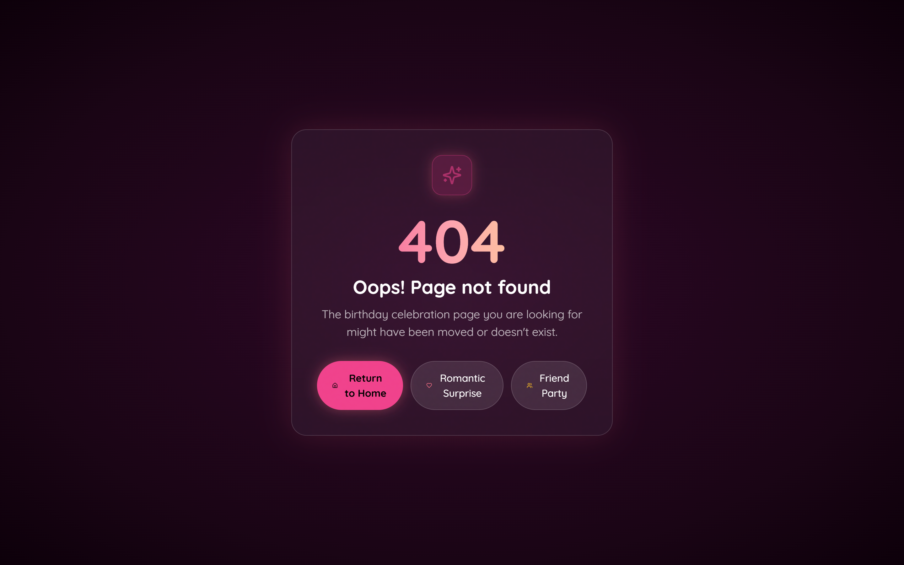 |
| *Instant social sharing for WhatsApp, X, Telegram, and link copy.* | *Glassmorphic fallback screen with quick-navigation buttons.* |

---

### 🌍 Multilingual & Cultural Personalization Matrix

Birthday Bloom provides culturally authentic celebrations in four languages, adjusting idioms, relationship themes, and typography:

<p align="center">
  
</p>

| Bengali Preset (বাংলা) | Hindi Preset (हिंदी) | French Preset (Français) |
| :---: | :---: | :---: |
|  |  |
|  |
| *শুভ জন্মদিন (Shuvo Jonmodin)* | *जन्मदिन की हार्दिक शुभकामनाएँ* | *Joyeux Anniversaire & Romance* |

---

### 📱 Responsive Mobile Touch Experience

| Mobile Celebration Hero | Mobile 3D Cake Cutting |
| :---: | :---: |
|  | 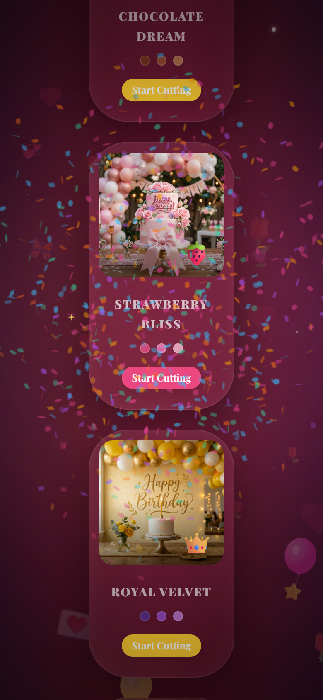 |
| *Touch-first responsive layout with dynamic confetti.* | *Smooth WebGL rendering optimized for mobile GPUs.* |

---

## 🏗️ System Architecture

Birthday Bloom operates as a structured timeline. The following diagram shows the chronological flow of scenes and interactive features from boot to the viral sharing stage:

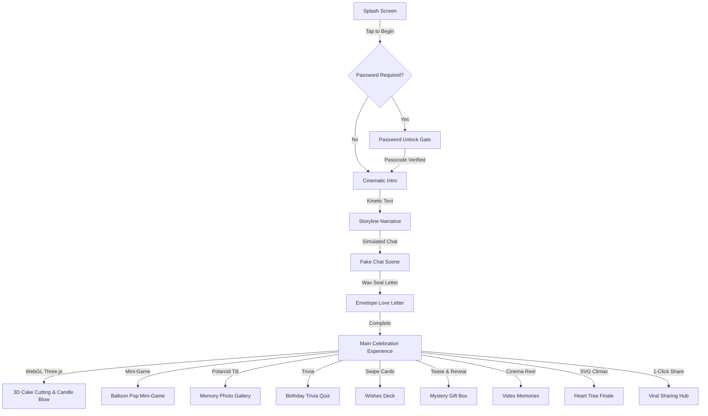
*Figure: Scene progression flow and interactive features from boot to the grand finale.*

### Config Engine Layer
The project resolves environment variables and hydrates application state through a central config layer:

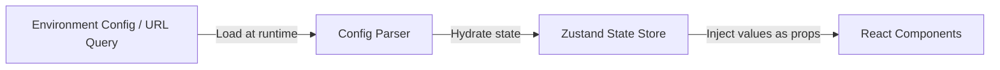
*Figure: The data flow from raw environment variables and URL parameters to component properties.*

### Sequence of Operations

The sequence is divided into two distinct interaction stages: the boot-to-intro phase, and the main dashboard user actions.

**Part A: Boot & Intro Sequence**
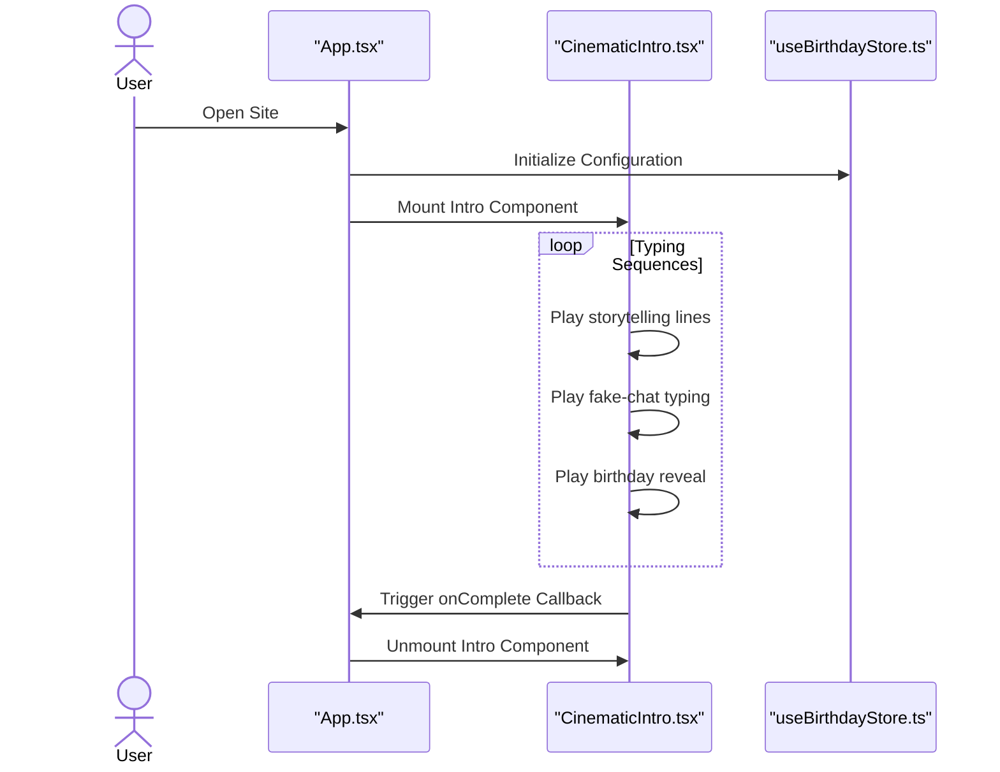
*Figure: Interaction sequence during the initialization and cinematic intro stages.*

**Part B: Main Dashboard Interactions**
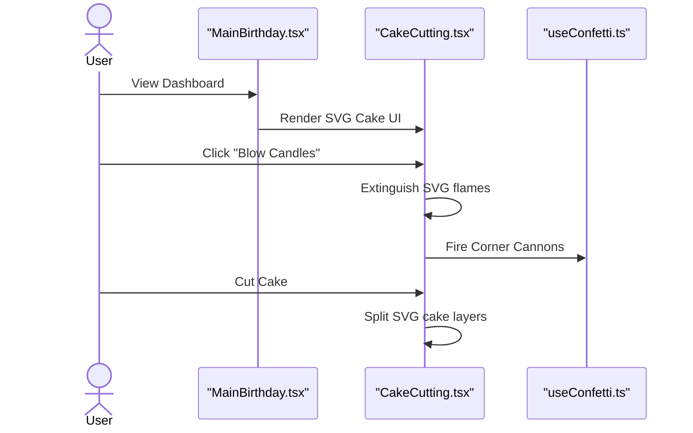
*Figure: User interactions within the main dashboard and interactive cake cutting engine.*

---

## 🕒 Mastering the Lifecycle

The animation sequence relies on a state machine configured in the entry files. Understanding how these scenes transition is essential before modifying the code.

<div align="center">
  <figure>
    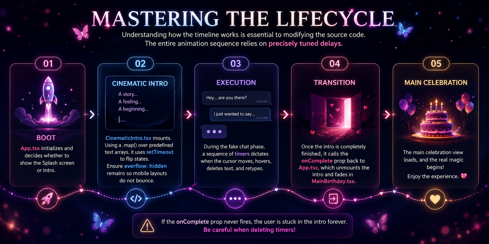
    <figcaption><em>Mastering the Lifecycle — a storyboard of Boot, Intro, Execution, Transition, and Celebration.</em></figcaption>
  </figure>
</div>

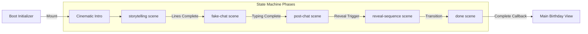
*Figure: The finite state machine phases and transitions of the application.*

1. **Boot**: `App.tsx` initializes, loads configuration settings, and decides whether to play the intro sequence based on setup parameters.
2. **Mount**: `CinematicIntro.tsx` mounts and maps over the custom narrative lines. Timers trigger transitions sequentially.
3. **Execution**: During the chat phase, sequence timers control text entry, deletions, and sending animations to simulate active conversations.
4. **Transition**: When the intro completes, the `onComplete` callback triggers the entry component to unmount the intro stage and render the `MainBirthday.tsx` dashboard. Modifying or removing these timers without care can lock the user inside the intro phase.


---

## 🧠 In-Depth Code Explanation

Because Birthday Bloom is designed to be fully customizable, the following sections deeply analyze exactly how the components function beneath the hood. If you intend to change pacing, layout, or animations, refer to this manual.

### 1. Cinematic Intro (`CinematicIntro.tsx`)
The `CinematicIntro` component is the bridge between the Splash Screen and the Main Dashboard. It handles a multi-phase emotional sequence.

**Code Breakdown:**
- **State Machine**: It uses a strongly typed literal state: `type Scene = "storytelling" | "fake-chat" | "post-chat" | "reveal-sequence" | "done"`.
- **Timer Management**: Instead of having floating timeouts that could cause memory leaks if a user unmounts early, we use `useRef<ReturnType<typeof setTimeout>[]>([]);` to store all timeout IDs, clearing them aggressively when the component unmounts or transitions.
- **The TypeWriter Component**: We use a custom `TypeWriter` component to begin rendering the string character-by-character based on specific speed delays.
- **Visuals**: Uses dynamic localized backgrounds. Depending on the `scene` state, the background shifts from dark blues to deep maroons, building tension.

### 2. The Interactive Cake (`CakeCutting.tsx`)
The most complex interactive piece of the platform.

<div align="center">
  <figure>
    
    <figcaption><em>Interactive Cake Cutting stage captured directly from the app experience.</em></figcaption>
  </figure>
</div>

**Code Breakdown:**
- **SVG Mastery**: The cake is drawn entirely with SVG. This prevents pixelation on high-density Retina displays (iPad Pro, 4K monitors, etc.).
- **Layers & Slices**: The SVG groups (`<g>`) are structurally separated into left and right halves. 
- **The Knife Phase**: 
  - Phase 1: User selects a themed cake (Chocolate, Strawberry, Velvet).
  - Phase 2: User triggers the "Blow Candles" mechanic. This toggles a boolean (`candlesLit`), transforming the animated SVG `<ellipse>` flames into rising smoke paths linearly.
  - Phase 3: The `KnifeSVG` enters with a CSS transform, splitting the left and right halves by applying `translateX` and `rotate` styles to the SVG groups.
- **Custom Easing**: The cake splits using `cubic-bezier(0.34, 1.56, 0.64, 1)`, a "bounce" easing that gives it physical weight, instead of `linear` or `ease-in-out`.

### 3. Typographic Storytelling (`TypeWriter.tsx`)
When building emotional tension, reading speed is everything. We moved away from instant text rendering to a programmatic typing approach.

**Code Breakdown:**
```tsx
  useEffect(() => {
    if (!started) return;
    if (displayed.length < text.length) {
      const timer = setTimeout(() => {
        setDisplayed(text.slice(0, displayed.length + 1));
      }, speed);
      return () => clearTimeout(timer);
    } else {
      setDone(true);
      onComplete?.();
    }
  }, [started, displayed, text, speed, onComplete]);
```
- **Recursive Growth**: It takes the current string, measures it against the target string length, and pushes exactly one additional character into the buffer.
- **Cursor Blinking**: A span element styled with `animate-blink` exists at the end of the text node while typing. Once `done` is true, the cursor hides gracefully, handing focus to the next element.

### 4. The Grand Finale: Heart Tree (`HeartTree.tsx`)
A new, premium addition to the end of the user experience. The growing Heart Tree serves as an emotional crescendo at the very bottom of the website.

**Code Breakdown:**
- **Sequential SVG Drawing**: Standard SVGs paint instantly. We want the tree to "grow" organically out of the ground. We use `stroke-dasharray` and `stroke-dashoffset`.
  - By setting `stroke-dasharray` equal to the total path length, we can completely hide the stroke by setting `stroke-dashoffset` to that same length.
  - A CSS transition reduces `stroke-dashoffset` to `0` over 1.5 seconds, creating a beautiful drawing effect.
- **Staging**:
  - `Stage 0`: Seed/Base.
  - `Stage 1`: Main thick branches grow.
  - `Stage 2`: Secondary, thinner branches sprout from the main lines.
  - `Stage 3`: Heart SVG paths (leaves) translate and scale up securely at branch nodes.
  - `Stage 4`: A radial CSS gradient overlay fades in, giving the entire tree a mystical "bloom" effect alongside floating `TreeSparks` particles.

### 5. Main Celebration View (`MainBirthday.tsx`)
The primary dashboard that users explore after the intro completes.

**Code Breakdown:**
- **Hero Stagger**: Features a large, centered hero section that fades up on mount. Uses the `TypeWriter` to write out the personalized `BIRTHDAY_NAME`.
- **Particle System Integration**: Implements both `Confetti.tsx` and `Balloons.tsx`.
- **Message Card Styling**: A meticulously crafted `div` utilizing `backdrop-blur-lg` (glassmorphism) and a complex dual-layer box-shadow (`boxShadow: "0 0 60px hsl(330, 85%, 60%, 0.15)"`) to create a glowing neon effect against a dark background.
- **Responsive Typographic Guard**: Heavy emphasis on `break-words` and `overflow-hidden`. As the TypeWriter injects strings into the DOM, it forces browser reflows; strict bounds ensure the layout does not jitter or expand horizontally on mobile screens. We lock `min-height` globally for paragraphs holding TypeWriter instances.

---

## 🎨 Personalization & Customization

Birthday Bloom is built to be customized using pure Environment Variables (Configuration Engine) and directly modifying assets. You do not need deep React knowledge to make this your own.

### Updating Personal Assets
1. Navigate to `/public/assets/birthday/`.
2. Replace the background images (`birthday-cute.png`, `birthday-gold.png`, etc.) with your own. Ensure they are optimized (WebP format recommended) and less than 500kb each to eliminate load stutter. High resolution images will delay the splash screen logic!
3. Replace `/public/assets/photo-1.jpg`, `photo-2.jpg`, and `photo-3.jpg` with actual photos of the person. Maintain aspect ratios if possible, or use `object-cover` tailwind classes if you inject custom resolutions.

### Modifying the Pacing & Narrative Flow
If the intro is too slow or too fast:
1. Open `src/components/birthday/CinematicIntro.tsx`.
2. Find the timer multipliers (e.g., `i * 5000` mapping over the `storyLines`).
3. Reduce `5000` to `3500` to speed up the pacing between storytelling lines.
4. Modify the `TypeWriter` speed props to `speed={30}` for extremely fast typing, or `speed={120}` for dramatic, slow typing.

---
<div align="center">
  <figure>
    
    <figcaption><em>Full env/secrets configuration guide.</em></figcaption>
  </figure>
</div>

## 🔐 Environment Variables & Secret Configuration Guide

The entire initialization process is controlled securely via the `.env` paradigm. **If you configure these variables, the website will bypass the setup wizard and immediately start the cinematic experience for the birthday person.**

| Variable Name | Required | Default Value | Description |
| :--- | :---: | :--- | :--- |
| `VITE_BIRTHDAY_NAME` | YES | `""` | The primary name of the person you are celebrating. Setting this automatically skips the config wizard. |
| `VITE_BIRTHDAY_AGE` | NO | `null` | The age they are turning. |
| `VITE_BIRTHDAY_GENDER` | NO | `"other"` | `"male"`, `"female"`, or `"other"`. |
| `VITE_BIRTHDAY_DATE` | NO | `null` | The specific date of the birthday. |
| `VITE_LANGUAGE` / `VITE_LANG` | NO | `"en"` | Multi-language localization switch: `"en"` (English - default), `"fr"` (French), `"hi"` (Hindi), `"bn"` (Bengali). Normalizes aliases (`fr`/`french`, `hi`/`hindi`, `bn`/`bengali`). |
| `VITE_BIRTHDAY_RELATIONSHIP` | NO | `"partner"` | Relationship template: `"partner"`, `"friend"`, `"brother"`, `"sister"`, `"father"`, `"mother"`, `"grandfather"`, `"grandmother"`, `"uncle"`, `"aunt"`, `"cousin"`, `"son"`, `"daughter"`, `"guardian"`, `"colleague"`, `"mentor"`, `"family"`. Fundamentally tailors mood, storytelling text, emotional letters, and emoji effects! |
| `VITE_BIRTHDAY_WISHER_NAME` | NO | `""` | The birthday wish sender's name, shown in the emotional letter and in the footer. |
| `VITE_BIRTHDAY_COLOR` / `VITE_FAVORITE_COLOR` | NO | `"#FF6B6B"` | A hex code defining the dynamic global theme, neon glows, and gradient backgrounds. |
| `VITE_BIRTHDAY_INTERESTS` / `VITE_FAVORITE_ITEMS` | NO | `""` | Comma-separated list of interests/items to customize ambient particles. |
| `VITE_BIRTHDAY_LETTER_TITLE` | NO | `""` | Optional heading for the emotional letter card. |
| `VITE_BIRTHDAY_LETTER_OVERRIDE` | NO | `""` | Replace the generated letter body with your own multi-line letter. |
| `VITE_BIRTHDAY_CUSTOM_MESSAGE` / `VITE_CUSTOM_MESSAGE` | NO | `""` | A heartfelt, custom message to reveal with kinetic typography right before the grand cake reveal. |
| `VITE_PHOTOS` / `VITE_PHOTO_1..6` | NO | `""` | Image URLs for polaroid gallery slides. If omitted, an elegant placeholder message is automatically shown. |
| `VITE_SPECIAL_MEMORIES` | NO | `""` | Special memories in `Title;imageUrl|Title;imageUrl` format. If omitted, the section is cleanly hidden. |
| `VITE_FINAL_VIDEO_URL` | NO | `""` | Final surprise YouTube video URL. Cleanly hidden if omitted. |
| `VITE_SOUND_URL` / `VITE_BGM_URL` | NO | `""` | The background music audio URL. |
| `VITE_SOUND_EFFECTS` | NO | `true` | Enable or disable SFX audio feedback. |
| `VITE_VIDEO_1`, `VITE_VIDEO_2`, `VITE_VIDEO_3` | NO | `""` | Adds video links (YouTube or MP4) to the final cinematic Video Gallery at the bottom of the page. |
| `VITE_PASSWORD_REQUIRED` | NO | `false` | Force enables the password lock page. |
| `VITE_PASSWORD` | NO | `""` | Manual password override (e.g. `love` or `1234`). |
| `VITE_PASSWORD_HINT` | NO | `""` | Customized emotional hint displayed if the user gets stuck. |
| `VITE_PASSWORD_FORMAT` | NO | `"MMDD"` | Format to auto-generate password from `VITE_BIRTHDAY_DATE` if `VITE_PASSWORD` is not set (e.g., MMDD, DDMM). |

**How to set this up locally:**
In the root of your project, create a file named `.env`. Add the following:
```env
VITE_BIRTHDAY_NAME="Riya"
VITE_BIRTHDAY_AGE="25"
VITE_BIRTHDAY_GENDER="female"
VITE_BIRTHDAY_DATE="2026-10-15"
VITE_BIRTHDAY_RELATIONSHIP="partner"
VITE_BIRTHDAY_WISHER_NAME="Alex"
VITE_FAVORITE_COLOR="#00C2FF"
VITE_FAVORITE_ITEMS="coffee, stars, music"
VITE_CUSTOM_MESSAGE="You mean the universe to me."
VITE_VIDEO_1="https://www.youtube.com/watch?v=dQw4w9WgXcQ"
```

### 🌍 Vercel Deployment Guide (Secret Surprise)
To deploy this project to the world for free:
1. Push this code to a private or public GitHub repository.
2. Log into [Vercel](https://vercel.com/) and click **Add New -> Project**.
3. Import your GitHub repository.
4. Open the **Environment Variables** section in the deployment settings.
5. Add the keys exactly as shown above (`VITE_BIRTHDAY_NAME`, `VITE_BIRTHDAY_RELATIONSHIP`, etc.) and provide the values.
6. Click **Deploy**! When the birthday person opens the Vercel link, it will launch their highly customized, surprise experience seamlessly without asking them for setup details.

---

## 🚀 Advanced Installation & Setup

For developers wanting to run this locally, clone, and fork:

### Software Requirements
- Node.js `v18.0.0` or higher
- npm `v9.0.0` or higher
- Git

### Step-by-Step Local Deployment
1. **Clone the repository:**
   ```bash
   git clone https://github.com/naborajs/birthday-bloom.git
   cd birthday-bloom
   ```
2. **Install local dependencies:**
   ```bash
   npm install
   ```
3. **Environment Setup:**
   ```bash
   cp .env.example .env
   # Edit .env with your favorite text editor
   ```
4. **Boot the Dev Server:**
   ```bash
   npm run dev
   ```
   *The server will boot on `http://localhost:5173`. Any changes to the `src` folder will trigger an instant Hot-Module-Replacement (HMR) reload in the browser without losing application state.*

---

<div align="center">
  <figure>
    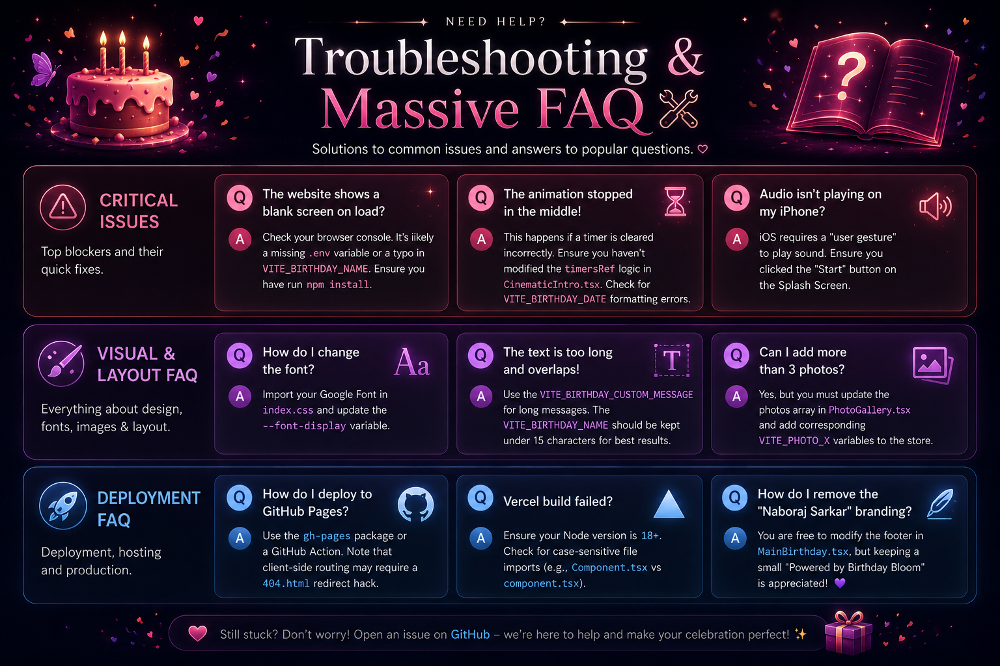
    <figcaption><em>All the info about the faq.</em></figcaption>
  </figure>
</div>

## 🛠️ Troubleshooting & Massive FAQ

### 🚨 Critical Issues

**Q: The website shows a blank screen on load?**
A: Check your browser console. It's likely a missing `.env` variable or a typo in `VITE_BIRTHDAY_NAME`. Ensure you have run `npm install`.

**Q: The animation stopped in the middle!**
A: This happens if a timer is cleared incorrectly. Ensure you haven't modified the `timersRef` logic in `CinematicIntro.tsx`. Check for `VITE_BIRTHDAY_DATE` formatting errors.

**Q: Audio isn't playing on my iPhone?**
A: iOS requires a "user gesture" to play sound. Ensure you clicked the "Start" button on the Splash Screen.

### 🎨 Visual & Layout FAQ

**Q: How do I change the font?**
A: Import your Google Font in `index.css` and update the `--font-display` variable.

**Q: The text is too long and overlaps!**
A: Use the `VITE_BIRTHDAY_CUSTOM_MESSAGE` for long messages. The `VITE_BIRTHDAY_NAME` should be kept under 15 characters for best results.

**Q: Can I add more than 3 photos?**
A: Yes, but you must update the `photos` array in `PhotoGallery.tsx` and add corresponding `VITE_PHOTO_X` variables to the store.

### 🚀 Deployment FAQ

**Q: How do I deploy to GitHub Pages?**
A: Use the `gh-pages` package or a GitHub Action. Note that client-side routing may require a `404.html` redirect hack.

**Q: Vercel build failed?**
A: Ensure your Node version is 18+. Check for case-sensitive file imports (e.g., `Component.tsx` vs `component.tsx`).

**Q: How do I remove the "Naboraj Sarkar" branding?**
A: You are free to modify the footer in `MainBirthday.tsx`, but keeping a small "Powered by Birthday Bloom" is appreciated!

---
<div align="center">
  <figure>
    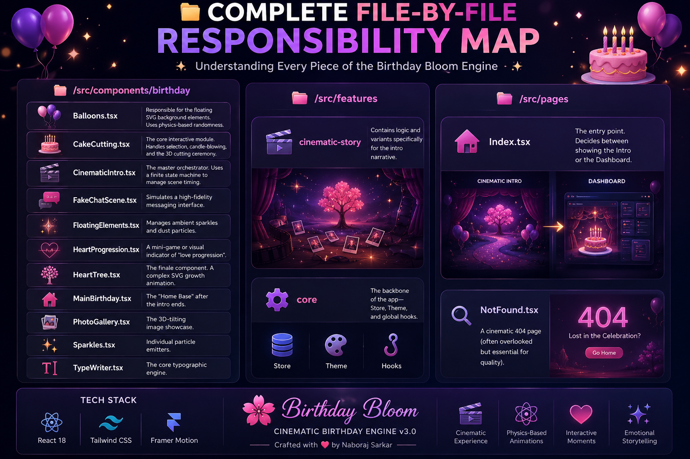
    <figcaption><em>Interactive Cake Cutting stage captured directly from the app experience.</em></figcaption>
  </figure>
</div>

## 📁 File-by-File Responsibility Map

The diagram below shows the high-level responsibilities of the primary directories:

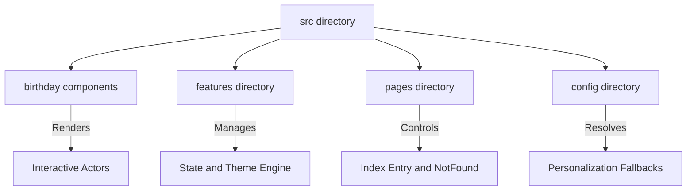
*Figure: High-level directory structure and core responsibilities.*

### `/src/components/birthday`
- **`Balloons.tsx`**: Floating SVG background balloons with random drift velocity.
- **`CakeCutting.tsx`**: Interactive birthday cake (handles candle extinguishing, layered SVG splitting, and quotes).
- **`CinematicIntro.tsx`**: Sequence orchestrator running the introduction scene state machine.
- **`FakeChatScene.tsx`**: Simulates the typing and bubbles of the fake messaging interface.
- **`FloatingElements.tsx`**: Manages the floating background particles and dust effects.
- **`HeartProgression.tsx`**: Visual heart tracker showing interaction progress.
- **`HeartTree.tsx`**: Sprouts and draws the growing branches and heart leaves using SVG stroke offsets.
- **`MainBirthday.tsx`**: Main landing view hosting the birthday message and interactive components.
- **`PhotoGallery.tsx`**: Polaroid photo gallery with dynamic 3D tilt effects.
- **`Sparkles.tsx`**: Controls individual sparkle particle emission.
- **`TypeWriter.tsx`**: Typographic component that types strings character-by-character recursively.

### `/src/features`
- **`cinematic-story`**: Animation variants and layout details for the intro text sequences.
- **`core`**: Global store (`useBirthdayStore`), theme loaders (`useDynamicTheme`), and global utilities.

### `/src/pages`
- **`Index.tsx`**: Directs routing by rendering either the Splash screen, Cinematic Intro, or Main Dashboard.
- **`NotFound.tsx`**: Custom 404 page for route handling.

---

## 🌍 Multi-Language Localization & Setup

Birthday Bloom natively supports **English (default)**, **French (Français)**, **Hindi (हिन्दी)**, and **Bengali (বাংলা)** with cultural nuance, emotional warmth, and authentic localized templates.

- 🇬🇧 [English Quick Start Guide](https://naborajs.me/projects/birthday-bloom/docs/quick-start) ([Local](./obsidian-docs/quick-start.md)) — 5-minute setup with zero code changes.
- 🇫🇷 [Guide de Configuration en Français (French Setup Guide)](https://naborajs.me/projects/birthday-bloom/docs/setup-french) ([Local](./obsidian-docs/setup-french.md)) — French emotional letters, quotes, cake names, and tone nuances.
- 🇮🇳 [हिंदी सेटअप गाइड (Hindi Setup Guide)](https://naborajs.me/projects/birthday-bloom/docs/setup-hindi) ([Local](./obsidian-docs/setup-hindi.md)) — Devanagari typography, Hindi emotional letters, and tone nuances.
- 🇧🇩 [বাংলা সেটআপ গাইড (Bengali Setup Guide)](https://naborajs.me/projects/birthday-bloom/docs/setup-bengali) ([Local](./obsidian-docs/setup-bengali.md)) — Eastern Nagari typography, Bengali emotional letters, and tone nuances.

To switch languages, set `VITE_LANGUAGE=fr` (French), `VITE_LANGUAGE=hi` (Hindi), or `VITE_LANGUAGE=bn` (Bengali) in your `.env.local` or hosting provider environment settings.

---

## 🛠️ Advanced Troubleshooting
If you encounter any specific issues with sound, animations, or deployment, please refer to our master troubleshooting suite:

- [🆘 Master Troubleshooting Guide](https://naborajs.me/projects/birthday-bloom/docs/troubleshooting) ([Local](./obsidian-docs/troubleshooting.md))
- [☁️ Hosting & Cloud Deployment Guide](https://naborajs.me/projects/birthday-bloom/docs/deployment) ([Local](./obsidian-docs/deployment.md))
- [❓ Frequently Asked Questions (FAQ)](https://naborajs.me/projects/birthday-bloom/docs/faq) ([Local](./obsidian-docs/faq.md))


---

## 🚀 Deployment & DevOps: The Ultimate Guide

### 1. Vercel (Recommended)
Vercel is the native home for Vite projects. 
1. Push to GitHub.
2. Link repo.
3. **Environment Variables**: Add all `VITE_` keys.
4. **Build Settings**: `npm run build`, `dist` directory.

### 2. Netlify
Similar to Vercel, but ensure you add a `_redirects` file if you use React Router.

### 3. Docker (Self-Hosted)
For those who want to host it on their own VPS.
```dockerfile
FROM node:18-alpine AS build
WORKDIR /app
COPY . .
RUN npm install && npm run build

FROM nginx:stable-alpine
COPY --from=build /app/dist /usr/share/nginx/html
EXPOSE 80
CMD ["nginx", "-g", "daemon off;"]
```

---

## 🎨 Mastering SVG Animations in Birthday Bloom

SVG is the heart of Birthday Bloom. Unlike raster images (JPEG/PNG), SVGs are code-based, which allows us to animate them with mathematical precision.

### 1. Stroke Dash Offset Growth
We use this for the Heart Tree. By setting `stroke-dasharray` and `stroke-dashoffset` to the total length of the path, we can "draw" the tree in real-time.
```css
@keyframes draw {
  to { stroke-dashoffset: 0; }
}
```

### 2. SVG Filters for 3D Depth
The 3D Cake isn't just flat shapes. We use `<feDropShadow>` and `<feGaussianBlur>` filters inside the SVG `<defs>` to create dynamic lighting. When you "blow" the candles, the light source shifts, changing the shadows on the cake layers.

### 3. Morphing Logic
While not used extensively yet, our engine supports path morphing. You can transform a circle into a heart by animating the `d` attribute using Framer Motion.

---

## 🆚 Birthday Bloom vs. Others

| Feature | Birthday Bloom | Generic Templates |
| :--- | :--- | :--- |
| **Performance** | 60fps (GPU Accelerated) | Laggy (CPU intensive) |
| **Customization** | Zero-Config (.env) | Manual Code Edits |
| **3D Effects** | Interactive & Tilting | Static Images |
| **Narrative** | Finite State Machine | Single Scroll Page |
| **Branding** | Naboraj Sarkar Premium | Generic / Watermarked |

---

## 🐳 Containerization & Orchestration: Production Deployment

For large-scale deployments or enterprise-level birthday surprises (yes, they exist), we support full containerization.

### 1. Dockerizing Birthday Bloom
Our Docker image is optimized using a multi-stage build to keep the footprint under 50MB.

```dockerfile
# Stage 1: Build
FROM node:20-slim AS builder
WORKDIR /app
COPY package*.json ./
RUN npm ci
COPY . .
RUN npm run build

# Stage 2: Serve
FROM nginx:alpine
COPY --from=builder /app/dist /usr/share/nginx/html
EXPOSE 80
CMD ["nginx", "-g", "daemon off;"]
```

### 2. Kubernetes (k8s) Deployment
If you are deploying this for a celebrity or a high-traffic event, use this manifest:

```yaml
apiVersion: apps/v1
kind: Deployment
metadata:
  name: birthday-bloom
spec:
  replicas: 3
  selector:
    matchLabels:
      app: birthday-bloom
  template:
    metadata:
      labels:
        app: birthday-bloom
    spec:
      containers:
      - name: birthday-bloom
        image: naborajs/birthday-bloom:latest
        ports:
        - containerPort: 80
---
apiVersion: v1
kind: Service
metadata:
  name: birthday-bloom-service
spec:
  type: LoadBalancer
  ports:
  - port: 80
    targetPort: 80
  selector:
    app: birthday-bloom
```

<div align="center">
  <figure>
    
    <figcaption><em>Launch your cinematic birthday surprise with env-driven configuration and a modern deployment workflow.</em></figcaption>
  </figure>
</div>

---

## 🌟 Contributing & Community

We welcome contributions of all types. If you find a bug, want to suggest features, improve documentation, or refine styles, please feel free to open an issue or submit a pull request. We thank everyone who uses, stars, or contributes to this repository.

---

## 🤝 Contributing

Birthday Bloom welcomes contributions of all kinds — bug fixes, documentation improvements, UI polish, accessibility enhancements, performance optimizations, and new features.

### 🎬 Video Guides for Contributors
We have created two animated walkthrough guides to help you contribute to Birthday Bloom:

#### 1. Official Contributing Guide (Overview)
<p align="center">
  <a href="https://youtu.be/V4XZRRvcxgk" target="_blank">
    
  </a>
</p>

<p align="center">
  <strong>🤝 Watch the Official Contributing Guide</strong><br>
  Learn how to contribute to <strong>Birthday Bloom</strong>, whether you're a first-time open-source contributor or an experienced developer. This guide covers GitHub Issues, feature requests, bug reports, forking the repository, creating branches, making meaningful commits, submitting Pull Requests, the code review process, and open-source best practices to help you become a successful contributor.
</p>

#### 2. Detailed Step-by-Step Contributor Guide (Explainer)
<p align="center">
  <a href="https://youtu.be/a9-ndTkD8IE" target="_blank">
    
  </a>
</p>

<p align="center">
  <strong>📚 Watch the Complete Contributor Guide</strong><br>
  Learn how to contribute to <strong>Birthday Bloom</strong> from start to finish. This step-by-step guide covers GitHub Issues, feature requests, bug reporting, forking the repository, cloning the project, creating branches, writing meaningful commit messages, opening Pull Requests, the review process, and open-source best practices. Whether you're making your first contribution or you're an experienced developer, this guide will help you confidently contribute to the project.
</p>

#### 🧠 Complete System Documentation & Official Web Portal

🌐 **Official Online Documentation Hub**: [https://naborajs.me/projects/birthday-bloom/docs](https://naborajs.me/projects/birthday-bloom/docs)

Birthday Bloom features a **complete 38-page documentation system** across 9 categories. Every page is accessible online with live interactive labs and simulators, as well as offline in the local `obsidian-docs/` vault:

| Category | Canonical Web Route | Local Note | Highlights |
|---|---|---|---|
| **1. Get Started** | [/docs/introduction](https://naborajs.me/projects/birthday-bloom/docs/introduction) | [`introduction.md`](./obsidian-docs/introduction.md) | Vision, 4 celebration phases, video tour, tech stack manifest |
| | [/docs/quick-start](https://naborajs.me/projects/birthday-bloom/docs/quick-start) | [`quick-start.md`](./obsidian-docs/quick-start.md) | 5-min setup, ports 5000/5173, diagnostic matrix |
| | [/docs/url-parameters](https://naborajs.me/projects/birthday-bloom/docs/url-parameters) | [`URL-Parameters.md`](./obsidian-docs/URL-Parameters.md) | Zero-config query parameter matrix (`?name=`, `?rel=`, `?color=`) |
| | [/docs/env-guide](https://naborajs.me/projects/birthday-bloom/docs/env-guide) | [`ENV_GUIDE.md`](./obsidian-docs/ENV_GUIDE.md) | 53-variable comprehensive registry, Vite bundling rules |
| **2. Architecture** | [/docs/architecture](https://naborajs.me/projects/birthday-bloom/docs/architecture) | [`architecture.md`](./obsidian-docs/architecture.md) | 4-Phase deterministic state machine (`src/pages/Index.tsx`) |
| | [/docs/architecture-env](https://naborajs.me/projects/birthday-bloom/docs/architecture-env) | [`architecture-env.md`](./obsidian-docs/architecture-env.md) | 3-Tier truth hierarchy (URL > `.env.local` > Defaults) |
| | [/docs/website-architecture](https://naborajs.me/projects/birthday-bloom/docs/website-architecture) | [`Website-Architecture.md`](./obsidian-docs/Website-Architecture.md) | Vite 5 build graph, Three.js chunk isolation (`three-[hash].js`) |
| | [/docs/codebase-map](https://naborajs.me/projects/birthday-bloom/docs/codebase-map) | [`Codebase-Map.md`](./obsidian-docs/Codebase-Map.md) | File tree manifest and architectural boundaries |
| **3. Visuals** | [/docs/birthday-components](https://naborajs.me/projects/birthday-bloom/docs/birthday-components) | [`Birthday-Components.md`](./obsidian-docs/Birthday-Components.md) | 3D WebGL cake, stainless knife, drag slicing math |
| | [/docs/animation-system](https://naborajs.me/projects/birthday-bloom/docs/animation-system) | [`Animation-System.md`](./obsidian-docs/Animation-System.md) | Framer Motion 13 springs, Canvas 2D confetti, 60 FPS mobile |
| | [/docs/sound-and-sensory](https://naborajs.me/projects/birthday-bloom/docs/sound-and-sensory) | [`Celebration-Sound-and-Sensory-Design.md`](./obsidian-docs/Celebration-Sound-and-Sensory-Design.md) | Web Audio API graph, SFX bus, iOS autoplay unlock gate |
| | [/docs/emotional-psychology](https://naborajs.me/projects/birthday-bloom/docs/emotional-psychology) | [`Emotional-Psychology-and-UX.md`](./obsidian-docs/Emotional-Psychology-and-UX.md) | Neurochemical pacing (mystery → anticipation → intimacy → euphoria) |
| **4. Persona** | [/docs/family-system](https://naborajs.me/projects/birthday-bloom/docs/family-system) | [`family-system.md`](./obsidian-docs/family-system.md) | 14 relationship archetypes, tone triggers, color palettes |
| | [/docs/template-architecture](https://naborajs.me/projects/birthday-bloom/docs/template-architecture) | [`template-architecture.md`](./obsidian-docs/template-architecture.md) | Token replacement lexer, surrogate-safe emoji slicing |
| | [/docs/template-deep-dive](https://naborajs.me/projects/birthday-bloom/docs/template-deep-dive) | [`Template-System-Deep-Dive.md`](./obsidian-docs/Template-System-Deep-Dive.md) | Emotional letter transcripts across tone engines |
| | [/docs/env-configs](https://naborajs.me/projects/birthday-bloom/docs/env-configs) | [`env-configs.md`](./obsidian-docs/env-configs.md) | 10 pre-built `.env.local` snippets for distinct relationships |
| **5. Localization** | [/docs/setup-hindi](https://naborajs.me/projects/birthday-bloom/docs/setup-hindi) | [`setup-hindi.md`](./obsidian-docs/setup-hindi.md) | Noto Sans Devanagari, Shirorekha protections, blessings |
| | [/docs/setup-bengali](https://naborajs.me/projects/birthday-bloom/docs/setup-bengali) | [`setup-bengali.md`](./obsidian-docs/setup-bengali.md) | Noto Sans Bengali typography, Eastern Nagari conjuncts |
| | [/docs/setup-french](https://naborajs.me/projects/birthday-bloom/docs/setup-french) | [`setup-french.md`](./obsidian-docs/setup-french.md) | French orthography, accents, formal/informal tones |
| **6. Tooling** | [/docs/developer-guide](https://naborajs.me/projects/birthday-bloom/docs/developer-guide) | [`developer-guide.md`](./obsidian-docs/developer-guide.md) | Custom hooks API reference (`useBirthdayStore`, `useDynamicTheme`) |
| | [/docs/ui-components](https://naborajs.me/projects/birthday-bloom/docs/ui-components) | [`UI-Components.md`](./obsidian-docs/UI-Components.md) | Radix UI primitives, glassmorphic styling tokens |
| | [/docs/styleguide](https://naborajs.me/projects/birthday-bloom/docs/styleguide) | [`styleguide.md`](./obsidian-docs/styleguide.md) | Strict TypeScript standards, zero `@ts-ignore`, ESLint rules |
| **7. Operations** | [/docs/github-automation](https://naborajs.me/projects/birthday-bloom/docs/github-automation) | [`GitHub-Automation.md`](./obsidian-docs/GitHub-Automation.md) | CI/CD pipelines, automated PR triage, labeler workflows |
| | [/docs/deployment](https://naborajs.me/projects/birthday-bloom/docs/deployment) | [`deployment.md`](./obsidian-docs/deployment.md) | Vercel, Netlify, Cloudflare Pages, Docker containerization |
| | [/docs/contributing](https://naborajs.me/projects/birthday-bloom/docs/contributing) | [`contributing.md`](./obsidian-docs/contributing.md) | Branching rules (`feat/`, `fix/`), Conventional Commits, PR checklist |
| **8. Masterclasses** | [/docs/video-tutorials](https://naborajs.me/projects/birthday-bloom/docs/video-tutorials) | [`video-tutorials.md`](./obsidian-docs/video-tutorials.md) | 5 official video walkthroughs (`R3XNhP9hSjw`, `VBgtLDP-vco`, etc.) |
| **9. Reference** | [/docs/troubleshooting](https://naborajs.me/projects/birthday-bloom/docs/troubleshooting) | [`troubleshooting.md`](./obsidian-docs/troubleshooting.md) | Diagnostics for audio, WebGL context, port collisions |
| | [/docs/faq](https://naborajs.me/projects/birthday-bloom/docs/faq) | [`faq.md`](./obsidian-docs/faq.md) | Stateless architecture, zero backend, zero cookies, mobile |
| | [/docs/security](https://naborajs.me/projects/birthday-bloom/docs/security) | [`security.md`](./obsidian-docs/security.md) | Zero-telemetry invariant, passcode validation mechanics |
| | [/docs/code-of-conduct](https://naborajs.me/projects/birthday-bloom/docs/code-of-conduct) | [`code-of-conduct.md`](./obsidian-docs/code-of-conduct.md) | Contributor Covenant v2.1 community standards |
| | [/docs/pull-request-policy](https://naborajs.me/projects/birthday-bloom/docs/pull-request-policy) | [`pull-request-policy.md`](./obsidian-docs/pull-request-policy.md) | Automated CI gates, branch protection, SLAs |
| | [/docs/support](https://naborajs.me/projects/birthday-bloom/docs/support) | [`support.md`](./obsidian-docs/support.md) | GitHub issues, Discord, direct maintainer email/WhatsApp |
| | [/docs/license](https://naborajs.me/projects/birthday-bloom/docs/license) | [`license.md`](./obsidian-docs/license.md) | MIT License text and third-party open-source attributions |
| | [/docs/test-infrastructure](https://naborajs.me/projects/birthday-bloom/docs/test-infrastructure) | [`test-infrastructure.md`](./obsidian-docs/test-infrastructure.md) | 400+ Vitest test architecture, JSDOM Web Audio/WebGL mocks |
| | [/docs/roadmap](https://naborajs.me/projects/birthday-bloom/docs/roadmap) | [`roadmap.md`](./obsidian-docs/roadmap.md) | Future milestones (WebGPU, procedural audio, offline PWA) |
| | [/docs/seo-guide](https://naborajs.me/projects/birthday-bloom/docs/seo-guide) | [`seo-guide.md`](./obsidian-docs/seo-guide.md) | Answer-first SEO/GEO, JSON-LD Schema.org structured data |
| | [/docs/migration-guide](https://naborajs.me/projects/birthday-bloom/docs/migration-guide) | [`migration-guide.md`](./obsidian-docs/migration-guide.md) | Upgrade guides v1 → v2 → v3 and breaking change checklists |
| | [/docs/changelog](https://naborajs.me/projects/birthday-bloom/docs/changelog) | [`changelog.md`](./obsidian-docs/changelog.md) | Chronological SemVer version history |

To explore via Obsidian:
1. Open the [Obsidian App](https://obsidian.md/).
2. Select "Open folder as vault" and choose the `obsidian-docs/` folder in this repository.
3. Start exploring from [`obsidian-docs/DOCUMENTATION_INDEX.md`](./obsidian-docs/DOCUMENTATION_INDEX.md) (or open the Graph View)!

---

## ⚡ Quick Start for Contributors

1. **Read [CONTRIBUTING.md](./.github/CONTRIBUTING.md)** for the full workflow
2. **Read [styleguide.md](./obsidian-docs/styleguide.md)** for code conventions
3. **Read [architecture.md](./obsidian-docs/architecture.md)** to understand the codebase
4. **Check [good first issues](https://github.com/naborajs/birthday-bloom/issues?q=is%3Aissue+is%3Aopen+label%3A%22good+first+issue%22)** for beginner-friendly tasks
5. **Fork, branch, commit, push, and PR** — see the [PR template](.github/pull_request_template.md)

### Contribution Areas

- 🐛 **Bug fixes** — Report and fix issues
- 📖 **Documentation** — Improve guides, fix typos, add examples
- ✨ **UI & Animations** — Polish the cinematic experience
- ♿ **Accessibility** — Make Birthday Bloom work for everyone
- ⚡ **Performance** — Keep it smooth on all devices
- 💡 **Features** — Extend existing systems, don't duplicate them

### Community Standards

All contributors are expected to follow our [CODE_OF_CONDUCT.md](./.github/CODE_OF_CONDUCT.md). Please be respectful, inclusive, and constructive.

---

## 🙌 Acknowledgments
- **React.js Team**
- **Framer Motion**
- **Tailwind CSS**
- **Vite**
- **Canvas-Confetti**
- **All the open-source contributors** who have made this project possible.


---


## 📜 License
This project is licensed under the **MIT License**. You are completely free to use, copy, modify, merge, publish, distribute, sublicense, and/or sell copies of the software with adequate attribution. Commercial use is permitted, though providing credit and starring the repository is deeply appreciated! See the `LICENSE` file for more details.

---


## 🎁 Gift of Code

We believe that code is a gift. That's why we made Birthday Bloom open-source and free for everyone. If you've used this to make someone happy, consider "paying it forward" by contributing a new feature or helping another developer in the community.

### Ways to Give Back
- Write a blog post or share how you used Birthday Bloom.
- Record a guide or tutorial to help other users.
- Donate to open-source libraries that we depend on (like Framer Motion).

---

## 📖 Open Source Ecosystem

Birthday Bloom comes with a complete open-source operating system to make contributing, maintaining, and collaborating easy.

### GitHub Automation

- **Issue Templates** — Structured forms for bugs, features, docs improvements, and performance reports
- **PR Template** — Contributor checklist to ensure quality
- **CI Pipeline** — Automated lint, typecheck, build, and test on every PR
- **Dependabot** — Weekly automated dependency updates
- **CODEOWNERS** — Clear ownership map for the repository

### Changelog

See [CHANGELOG.md](./CHANGELOG.md) for the full version history.

### Versioning

This project follows [Semantic Versioning](https://semver.org/). Major releases are tracked in releases and summarized in the changelog.

---

## 🏁 Final Conclusion

**Birthday Bloom** is more than code. It's a bridge between technology and human emotion. Whether you're a developer looking for a cool project or a friend looking to make a surprise, we hope this engine serves you well.

### ✨ Join the Movement
- **Star the Repo**: Help us reach the top of GitHub Trending!
- **Share your Story**: Use `#BirthdayBloom` on social media.
- **Contribute**: We welcome all PRs.

---

## 👤 Author

Birthday Bloom was created and is maintained by **Naboraj Sarkar**. If you find this project useful or want to support future work, feel free to connect via the contact channels below.

---
<div align="center">
  <figure>
    
    <figcaption><em>Check out the contribution guidelines to get started!</em></figcaption>
  </figure>
</div>

---

Developed by Naboraj Sarkar. Contributions and improvements are welcome.

---

## 📞 Contact & Support & Socials (Connect with me)

> Need help, collab, or just want to connect? 👇

- 📧 **Email** → [msg@naborajs.me](mailto:msg@naborajs.me)  
- 💬 **WhatsApp** → [Message Me now](https://wa.me/918900653250?text=Hey%20I%20am%20coming%20from%20your%20Birthday%20Bloom%20project%20on%20GitHub%2C%20I%20want%20to%20talk%20about%20it)
- 💬 **Telegram** → [@Nishantsarkar10k](https://t.me/Nishantsarkar10k)  
- 🐦 **Twitter (X)** → [@ItsNaborajs](https://x.com/ItsNaborajs)
- 📸 **Instagram** → [@naborajs](https://instagram.com/naborajs)
- 🌐 **Website** → [naborajs.com](https://naborajs.me)  
- 🐙 **GitHub** → [github.com/naborajs]
- 🎥 **YouTube** → [Naboraj Sarkar Channel](https://youtube.com/@nishant_sarkar)


---

## 👥 Contributors

Thank you to all the incredible people who have contributed to making Birthday Bloom a reality! 🙌

<a href="https://github.com/naborajs/birthday-bloom/graphs/contributors">
  
</a>

---

<div align="center">
  <sub>Built with ❤️ by Naboraj Sarkar. © 2024-2026 Naboraj Sarkar.</sub>
</div>

**[Back to Top ↑](#-birthday-bloom--configurable-birthday-landing-page-v340)**
