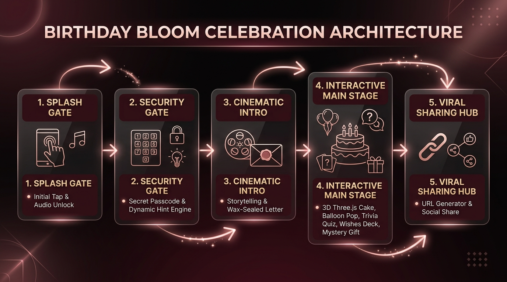

# Birthday Bloom — Master Documentation Index

🌐 **Official Online Documentation Portal**: [https://naborajs.me/projects/birthday-bloom/docs](https://naborajs.me/projects/birthday-bloom/docs)  
Repository: [naborajs/birthday-bloom](https://github.com/naborajs/birthday-bloom) | Live Demo: [birthday-bloom.vercel.app](https://birthday-bloom.vercel.app)

Welcome to the **complete 38-page documentation system for Birthday Bloom**, an env-first, zero-config cinematic birthday surprise engine built with React 18.3, TypeScript 5.8, Three.js 0.171 / React Three Fiber, Framer Motion 13, Tailwind CSS, and Zustand 5.

Every page is available both as an interconnected Obsidian note in this vault and online at `https://naborajs.me/projects/birthday-bloom/docs/*`.

---

## 📸 Visual Architecture & Multilingual Showcase

### Celebration Lifecycle State Machine


### Multilingual & Cultural Personalization Matrix


---

## 🗂️ Complete 38-Page Documentation Directory (9 Categories)

### Category 1: Get Started
| # | Document & Local Note | Canonical Web Route | Purpose & Key Contents |
|---|---|---|---|
| 1 | [[introduction\|introduction.md]] | [/docs/introduction](https://naborajs.me/projects/birthday-bloom/docs/introduction) | **Introduction to Birthday Bloom**: Executive vision, 4-phase sequence table, tech manifest, audience pathways, and intro video. |
| 2 | [[quick-start\|quick-start.md]] | [/docs/quick-start](https://naborajs.me/projects/birthday-bloom/docs/quick-start) | **Quick Start Guide**: 5-minute local setup, port configurations, terminal commands, and error diagnostic matrix. |
| 3 | [[URL-Parameters\|URL-Parameters.md]] | [/docs/url-parameters](https://naborajs.me/projects/birthday-bloom/docs/url-parameters) | **Zero-Config URL Parameters**: Instant sharing via query strings (`?name=`, `?rel=`, `?color=`, `?passcode=`), hex validation, and URL-first hydration. |
| 4 | [[ENV_GUIDE\|ENV_GUIDE.md]] | [/docs/env-guide](https://naborajs.me/projects/birthday-bloom/docs/env-guide) | **Environment Variables Master Guide**: Comprehensive 53-variable registry, Vite `VITE_` bundling rules, and situation recipes. |

---

### Category 2: Architecture & Core
| # | Document & Local Note | Canonical Web Route | Purpose & Key Contents |
|---|---|---|---|
| 5 | [[architecture\|architecture.md]] | [/docs/architecture](https://naborajs.me/projects/birthday-bloom/docs/architecture) | **System Architecture & FSM**: 4-phase deterministic state machine (`splash` → `unlock` → `intro` → `main`), browser autoplay mitigation, and memory safety. |
| 6 | [[architecture-env\|architecture-env.md]] | [/docs/architecture-env](https://naborajs.me/projects/birthday-bloom/docs/architecture-env) | **Env Lifecycle & Store Hydration**: 3-tier hierarchy of truth (URL > `.env.local` > Defaults), type coercion, and Zustand store hydration. |
| 7 | [[Website-Architecture\|Website-Architecture.md]] | [/docs/website-architecture](https://naborajs.me/projects/birthday-bloom/docs/website-architecture) | **Build Toolchain & Rendering Pipeline**: Vite 5 compilation graph, Three.js chunk isolation (`three-[hash].js`), and CSS tree-shaking. |
| 8 | [[Codebase-Map\|Codebase-Map.md]] | [/docs/codebase-map](https://naborajs.me/projects/birthday-bloom/docs/codebase-map) | **Codebase Directory Map & File Manifest**: Complete file tree and single responsibility architectural boundaries across `src/`, `public/`, and configs. |

---

### Category 3: Components & Visuals
| # | Document & Local Note | Canonical Web Route | Purpose & Key Contents |
|---|---|---|---|
| 9 | [[Birthday-Components\|Birthday-Components.md]] | [/docs/birthday-components](https://naborajs.me/projects/birthday-bloom/docs/birthday-components) | **3D WebGL Canvas & Component Hierarchy**: R3F scene graph, procedural 3D cake, stainless steel knife, raycast drag slicing math, and contact lighting. |
| 10 | [[Animation-System\|Animation-System.md]] | [/docs/animation-system](https://naborajs.me/projects/birthday-bloom/docs/animation-system) | **Animation & Physics Engine**: Framer Motion 13 springs, HTML5 Canvas 2D confetti physics, fireworks engines, and 60 FPS mobile optimizations. |
| 11 | [[Celebration-Sound-and-Sensory-Design\|Celebration-Sound-and-Sensory-Design.md]] | [/docs/sound-and-sensory](https://naborajs.me/projects/birthday-bloom/docs/sound-and-sensory) | **Audio Synthesis & Sensory Design**: Web Audio API singleton graph, gain staging, SFX bus, biquad filters, and iOS Safari autoplay unlocking. |
| 12 | [[Emotional-Psychology-and-UX\|Emotional-Psychology-and-UX.md]] | [/docs/emotional-psychology](https://naborajs.me/projects/birthday-bloom/docs/emotional-psychology) | **Emotional Psychology & Narrative Arc**: Neurochemical pacing (mystery → anticipation → intimacy → euphoria), typewriter constants, and emotional UX. |

---

### Category 4: Persona & Customization
| # | Document & Local Note | Canonical Web Route | Purpose & Key Contents |
|---|---|---|---|
| 13 | [[family-system\|family-system.md]] | [/docs/family-system](https://naborajs.me/projects/birthday-bloom/docs/family-system) | **14-Persona Relationship Engine**: Archetype matrix (Partner, Friend, Mother, Father, Brother, Sister, Mentor, Custom) and token triggers. |
| 14 | [[template-architecture\|template-architecture.md]] | [/docs/template-architecture](https://naborajs.me/projects/birthday-bloom/docs/template-architecture) | **Template Engine & Letter Synthesis**: Token replacement lexer (`{name}`, `{age}`, `{wisher}`) and surrogate-safe emoji typewriter slicing. |
| 15 | [[Template-System-Deep-Dive\|Template-System-Deep-Dive.md]] | [/docs/template-deep-dive](https://naborajs.me/projects/birthday-bloom/docs/template-deep-dive) | **Deep Dive: Letter Engine & Micro-copy**: Full emotional letter transcripts across tone engines and override precedence rules. |
| 16 | [[env-configs\|env-configs.md]] | [/docs/env-configs](https://naborajs.me/projects/birthday-bloom/docs/env-configs) | **Pre-built Persona Configurations**: Ready-to-use copy-paste `.env.local` snippets and color hex/music pairings for 10 celebration scenarios. |

---

### Category 5: Internationalization (i18n)
| # | Document & Local Note | Canonical Web Route | Purpose & Key Contents |
|---|---|---|---|
| 17 | [[setup-hindi\|setup-hindi.md]] | [/docs/setup-hindi](https://naborajs.me/projects/birthday-bloom/docs/setup-hindi) | **Hindi (हिंदी) Localization & Devanagari Typography**: Noto Sans Devanagari loading, Shirorekha ligature protections, and culturally authentic blessings. |
| 18 | [[setup-bengali\|setup-bengali.md]] | [/docs/setup-bengali](https://naborajs.me/projects/birthday-bloom/docs/setup-bengali) | **Bengali (বাংলা) Cultural Nuances & Shirorekha**: Noto Sans Bengali typography, Eastern Nagari conjunct rendering, and poetic greetings. |
| 19 | [[setup-french\|setup-french.md]] | [/docs/setup-french](https://naborajs.me/projects/birthday-bloom/docs/setup-french) | **French (Français) Elegant Locales & Accents**: French orthography, accents (`é`, `è`, `ç`), non-breaking punctuation spacing, and formal/informal tones. |

---

### Category 6: Developer & Tooling
| # | Document & Local Note | Canonical Web Route | Purpose & Key Contents |
|---|---|---|---|
| 20 | [[developer-guide\|developer-guide.md]] | [/docs/developer-guide](https://naborajs.me/projects/birthday-bloom/docs/developer-guide) | **Developer Reference & Hooks**: Custom hooks API reference (`useBirthdayStore`, `useDynamicTheme`, `useSoundEffects`, `useMobile`) and contributor walkthroughs. |
| 21 | [[UI-Components\|UI-Components.md]] | [/docs/ui-components](https://naborajs.me/projects/birthday-bloom/docs/ui-components) | **Design System Primitives**: Radix UI tokens, glassmorphic styling (`backdrop-blur-xl`), and CSS variable injection. |
| 22 | [[styleguide\|styleguide.md]] | [/docs/styleguide](https://naborajs.me/projects/birthday-bloom/docs/styleguide) | **TypeScript & Code Standards**: Strict mode conventions, zero `@ts-ignore` policy, explicit interface declarations, and naming conventions. |

---

### Category 7: Operations & Contribution
| # | Document & Local Note | Canonical Web Route | Purpose & Key Contents |
|---|---|---|---|
| 23 | [[GitHub-Automation\|GitHub-Automation.md]] | [/docs/github-automation](https://naborajs.me/projects/birthday-bloom/docs/github-automation) | **GitHub Actions & CI/CD Pipelines**: Automated pull request gates, labeler workflows, quality checks, and release packaging. |
| 24 | [[deployment\|deployment.md]] | [/docs/deployment](https://naborajs.me/projects/birthday-bloom/docs/deployment) | **Production Deployment Guide**: Step-by-step walkthrough for Vercel, Netlify, Cloudflare Pages, and sovereign Docker containerization. |
| 25 | [[contributing\|contributing.md]] | [/docs/contributing](https://naborajs.me/projects/birthday-bloom/docs/contributing) | **Contributor Guide & Workflow Standards**: Branch management (`feat/`, `fix/`, `docs/`), Conventional Commits, and PR verification checklist. |

---

### Category 8: Masterclasses & Video Tutorials
| # | Document & Local Note | Canonical Web Route | Purpose & Key Contents |
|---|---|---|---|
| 26 | [[video-tutorials\|video-tutorials.md]] | [/docs/video-tutorials](https://naborajs.me/projects/birthday-bloom/docs/video-tutorials) | **Official Video Tutorials & Masterclasses**: 5 high-definition YouTube walkthroughs (`R3XNhP9hSjw`, `VBgtLDP-vco`, `gwq1IaHXUn4`, `V4XZRRvcxgk`, `a9-ndTkD8IE`). |

---

### Category 9: Reference & Support
| # | Document & Local Note | Canonical Web Route | Purpose & Key Contents |
|---|---|---|---|
| 27 | [[troubleshooting\|troubleshooting.md]] | [/docs/troubleshooting](https://naborajs.me/projects/birthday-bloom/docs/troubleshooting) | **Troubleshooting & Error Diagnostics**: Solutions for WebGL context loss, audio autoplay blocks, port collisions, and terminal recovery commands. |
| 28 | [[faq\|faq.md]] | [/docs/faq](https://naborajs.me/projects/birthday-bloom/docs/faq) | **Frequently Asked Questions (FAQ)**: Privacy assurances, zero-backend model, free hosting limits, mobile support, and commercial licensing. |
| 29 | [[security\|security.md]] | [/docs/security](https://naborajs.me/projects/birthday-bloom/docs/security) | **Security Model & Privacy Guarantees**: Zero-telemetry invariant, passcode validation mechanics, and responsible vulnerability disclosure. |
| 30 | [[code-of-conduct\|code-of-conduct.md]] | [/docs/code-of-conduct](https://naborajs.me/projects/birthday-bloom/docs/code-of-conduct) | **Contributor Code of Conduct**: Contributor Covenant v2.1 standards, inclusive community pledge, and enforcement procedures. |
| 31 | [[pull-request-policy\|pull-request-policy.md]] | [/docs/pull-request-policy](https://naborajs.me/projects/birthday-bloom/docs/pull-request-policy) | **Pull Request Policy & Quality Gates**: Merge requirements, branch protection rules, automated PR labeling, and review turnaround SLAs. |
| 32 | [[support\|support.md]] | [/docs/support](https://naborajs.me/projects/birthday-bloom/docs/support) | **Community Support & Channels**: GitHub Issues, Discord, direct maintainer email, WhatsApp, and social communication channels. |
| 33 | [[license\|license.md]] | [/docs/license](https://naborajs.me/projects/birthday-bloom/docs/license) | **MIT License & Legal Attribution**: Permissive open-source license text, commercial reuse rights, and third-party attributions. |
| 34 | [[test-infrastructure\|test-infrastructure.md]] | [/docs/test-infrastructure](https://naborajs.me/projects/birthday-bloom/docs/test-infrastructure) | **Test Infrastructure & Vitest Architecture**: 400+ automated Vitest tests, JSDOM mocks for Web Audio / WebGL, and execution commands. |
| 35 | [[roadmap\|roadmap.md]] | [/docs/roadmap](https://naborajs.me/projects/birthday-bloom/docs/roadmap) | **Architectural Roadmap & Milestones**: Future milestones including WebGPU pipelines, procedural audio synthesis, and offline PWA capabilities. |
| 36 | [[seo-guide\|seo-guide.md]] | [/docs/seo-guide](https://naborajs.me/projects/birthday-bloom/docs/seo-guide) | **Search Engine & LLM Discoverability Guide**: Answer-first SEO/GEO, JSON-LD Schema.org structured metadata, Open Graph, and crawler directives. |
| 37 | [[migration-guide\|migration-guide.md]] | [/docs/migration-guide](https://naborajs.me/projects/birthday-bloom/docs/migration-guide) | **Migration & Breaking Changes Guide**: Step-by-step upgrade guides from v1 → v2 → v3 and deprecated parameter mappings. |
| 38 | [[changelog\|changelog.md]] | [/docs/changelog](https://naborajs.me/projects/birthday-bloom/docs/changelog) | **Project Changelog & Release Notes**: Full SemVer-compliant release history detailing Added, Changed, Fixed, and Removed features. |

---

## 🎯 Documentation by Use Case

### 1. New to Birthday Bloom?
1. [[introduction|Introduction]] — Project vision, 4-phase sequence, and video walkthrough.
2. [[quick-start|Quick Start Guide]] — Install dependencies and run locally in 5 minutes.
3. [[URL-Parameters|URL Parameters Guide]] — Instant zero-code personalization via query strings.
4. [[ENV_GUIDE|ENV Guide]] — Learn all 53 customizable settings and situation recipes.
5. [[faq|Frequently Asked Questions]] — Common inquiries and zero-backend guarantees.

### 2. Customizing for a Specific Person or Language
1. **Multi-Language Setup**:
   - English (Default): [[quick-start|quick-start.md]]
   - French (Français): [[setup-french|setup-french.md]]
   - Hindi (हिन्दी): [[setup-hindi|setup-hindi.md]]
   - Bengali (বাংলা): [[setup-bengali|setup-bengali.md]]
2. **Relationships & Tone**:
   - Romantic Partner: [[ENV_GUIDE#Situation-Recipes|ENV_GUIDE.md]] & [[family-system#Romantic-Partner-Archetype|family-system.md]]
   - Sibling / Brother / Sister: [[family-system#Sibling-Archetype|family-system.md]]
   - Parents & Grandparents: [[family-system#Parental-Archetypes|family-system.md]]
   - Best Friend: [[ENV_GUIDE#Situation-Recipes|ENV_GUIDE.md]]
3. [[Template-System-Deep-Dive|Template Deep Dive]] — Cultural tone engines and letter generation.
4. [[env-configs|Pre-built Persona Configurations]] — 10 ready-to-copy `.env.local` snippets.

### 3. Contributing & Code Development
1. [[contributing|Contributor Guide]] & [[pull-request-policy|Pull Request Policy]] — Git workflow and quality gates.
2. [[styleguide|TypeScript & Code Standards]] — Strict mode, naming conventions, and CSS tokens.
3. [[architecture|System Architecture & FSM]] — 4-phase finite state machine orchestration.
4. [[developer-guide|Developer Reference]] — Custom hooks API and component walkthroughs.
5. [[Birthday-Components|Birthday Components]] — 3D WebGL cake, knife physics, and particle overlays.
6. [[test-infrastructure|Test Infrastructure]] — Vitest test suites, JSDOM mocks, and verification gates.

### 4. Deploying to Production
1. [[deployment|Deployment Guide]] — Walkthroughs for Vercel, Netlify, Cloudflare Pages, and Docker.
2. [[ENV_GUIDE|ENV Guide]] — Production environment variable configuration.
3. [[seo-guide|SEO & GEO Guide]] — Open Graph, Twitter cards, and JSON-LD schema metadata.
4. [[troubleshooting|Troubleshooting]] — Pre-launch checklist & production troubleshooting.

---

## 📂 Repository File Structure

```
birthday-bloom/
├── .env.example                # Exhaustive 53 environment variables template
├── ENV_GUIDE.md                # Root markdown customization reference & recipes
├── CONTRIBUTING.md             # Root 10-minute fast-track contributor guide
├── README.md                   # Project introduction and video guides
├── CHANGELOG.md                # Version history
├── LICENSE                     # MIT License
├── llm.txt                     # AI-friendly root developer map
├── .github/                    # GitHub actions, workflows, and governance policies
├── obsidian-docs/              # Complete 38-note Obsidian documentation vault
│   ├── DOCUMENTATION_INDEX.md  # Master documentation index (this file)
│   ├── introduction.md         # Introduction to Birthday Bloom
│   ├── quick-start.md          # 5-minute setup and local development
│   ├── URL-Parameters.md       # Zero-config query parameter engine
│   ├── ENV_GUIDE.md            # Master 53 environment variable reference
│   ├── architecture.md         # 4-phase finite state machine runtime
│   ├── architecture-env.md     # 3-tier store hydration & precedence
│   ├── Website-Architecture.md # Build toolchain & rendering pipeline
│   ├── Codebase-Map.md         # Directory structure and module responsibilities
│   ├── Birthday-Components.md  # 3D WebGL scene and celebration components
│   ├── Animation-System.md     # Framer Motion 13 & Canvas 2D fireworks
│   ├── Celebration-Sound-and-Sensory-Design.md # Web Audio API singleton graph
│   ├── Emotional-Psychology-and-UX.md # Neurochemical narrative arc & pacing
│   ├── family-system.md        # 14-persona relationship archetype matrix
│   ├── template-architecture.md# Token lexer and emoji typewriter slicing
│   ├── Template-System-Deep-Dive.md # Narrative letter transcripts & tone
│   ├── env-configs.md          # 10 ready-to-copy .env.local persona recipes
│   ├── setup-hindi.md          # Hindi Devanagari typography & blessings
│   ├── setup-bengali.md        # Bengali Eastern Nagari typography & greetings
│   ├── setup-french.md         # French orthography, accents, and tones
│   ├── developer-guide.md      # Custom hooks reference and developer guide
│   ├── UI-Components.md        # Radix UI primitives and glassmorphic styling
│   ├── styleguide.md           # Strict mode TypeScript and design tokens
│   ├── GitHub-Automation.md    # CI/CD pipelines and PR automated triage
│   ├── deployment.md           # Vercel, Netlify, Cloudflare & Docker deployment
│   ├── contributing.md         # Branching conventions and PR verification
│   ├── video-tutorials.md      # 5 official high-definition video walkthroughs
│   ├── troubleshooting.md      # Standalone diagnostic matrix and recovery
│   ├── faq.md                  # Frequently asked questions and privacy
│   ├── security.md             # Security model and zero-telemetry invariant
│   ├── code-of-conduct.md      # Contributor Covenant v2.1 community pledge
│   ├── pull-request-policy.md  # Quality gates, SLAs, and merge policies
│   ├── support.md              # Community support channels and direct contact
│   ├── license.md              # Permissive MIT License and attributions
│   ├── test-infrastructure.md  # 400+ Vitest test architecture and mocks
│   ├── roadmap.md              # Planned milestones (WebGPU, offline PWA)
│   ├── seo-guide.md            # Answer-first SEO, GEO, and JSON-LD schema
│   ├── migration-guide.md      # Breaking change upgrade guides v1 → v2 → v3
│   └── changelog.md            # Chronological SemVer release history
├── public/                     # Static assets, llms.txt, sitemaps, favicons
└── src/                        # React 18 application source code
```

---

**Made with ❤️ by Naboraj Sarkar**  
*In the garden of the internet, may your digital memories always bloom.*

#obsidian #documentation #birthday-bloom #vault #index #38-pages