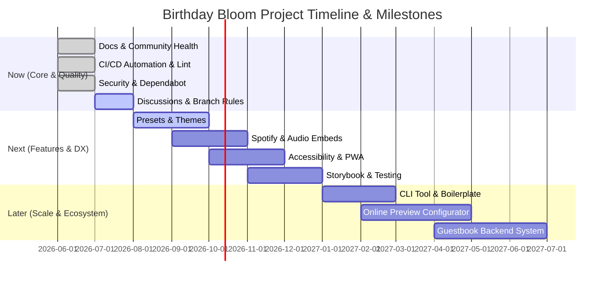

# 🌸 Birthday Bloom — Detailed Project Roadmap

🌐 **Canonical Web Documentation**: [Architectural Roadmap & Milestones](https://naborajs.me/projects/birthday-bloom/docs/roadmap)

Welcome to the official roadmap for **Birthday Bloom**. This document details our planned future, ongoing work, and ultimate vision for this interactive birthday landing page platform.

> [!NOTE]
> Timelines are estimates and driven by community needs and contributor availability. We welcome feedback and contributions to speed up any of these items!

---

## 🎨 Project Vision & Philosophy

Birthday Bloom's goal is to turn a static landing page into a **cinematic, interactive stage** in the browser. 

* **Config-First:** We want non-coders to customize everything through environment variables.
* **Performance-First:** Keep bundle sizes low, animations at 60fps, and avoid heavy external rendering engines.
* **Emotion-Driven:** Structure the pacing of text, audio, and visual reveals to build anticipation and surprise.

---

## 📅 Roadmap Overview

---

## 🟢 Phase 1: Now — Quality & Community Foundation
*Focus: Deepen repository stability, build infrastructure, and improve developer experience (DX).*

### 🛠️ Completed Milestones (v3.0 → v3.3)
* **✅ Universal URL Query Parameter Engine**
  * Instant client-side personalization (`?name=...&rel=...&lang=...`) without code changes or redeployment.
* **✅ Dynamic Runtime SEO & Schema.org Structured Data**
  * Live `SocialEvent` JSON-LD schema, OpenGraph tags, multilingual keywords, and canonical link generation.
* **✅ Comprehensive Vitest 3 Test Infrastructure**
  * 17 automated test suites with 408 unit and integration tests running with zero warnings in under 2.6 seconds.
* **✅ Automated Dependency Management & Safety Guards**
  * Dependabot grouped scheduling with semver-major safety ignores for breaking ecosystem packages.
* **✅ Pruned Unused Dependencies & Tree-Shaking**
  * Removed 34 unused UI packages, reducing bundle size and speeding up Vite production builds (<900ms).
* **✅ 4-Language Cultural Localization Engine**
  * Full localization across English, French, Hindi, and Bengali with authentic emotional letter templates.

### ⏳ Current Work-in-Progress
* **🔄 Community Discussions Hub**
  * Enable GitHub Discussions to allow users to share their own deployed sites, request features, and get troubleshooting support.
* **🔒 Branch Protection Safeguards**
  * Set up strict branch requirements for the `main` branch to guarantee all commits pass CI tests before being merged.

---

## 🟡 Phase 2: Next — Features & Polish
*Focus: Add premium customization options, enrich media interactivity, and enhance core performance.*

### 🎨 Templates & Personalization Presets
* **Celebration Presets:** Drop-in themes and layouts for different milestones (e.g. *Anniversaries*, *Graduations*, *Mother's/Father's Day*).
* **Pre-built Theme Packs:** Preset theme combinations of HSL colors and background gradients that can be switched via a single environment variable.
* **Group Celebrations Mode:** Support for multiple people writing messages and signing the card together.

### 🎵 Media & Content Integrations
* **Native Audio & Spotify Embed:** Direct integrations to load background tracks seamlessly from Spotify or YouTube Music without breaking the page's audio lifecycle.
* **Native Video Embed Support:** Clean wrapper components to display YouTube, Vimeo, or local HTML5 videos beautifully inside the birthday cinematic intro.

### 📱 Accessibility & Mobile Improvements
* **Screen Reader Audit (A11y):** Ensure all interactive triggers (like blowing candles and popping balloons) have correct ARIA labels and focus states.
* **PWA (Progressive Web App):** Add a manifest file and service workers so the experience can be saved to a mobile home screen like a native app.
* **Offline Compatibility:** Cache key assets (music, images, SVG icons) to allow offline loads.

### 💻 Developer Experience (DX)
* **Storybook Integration:** Set up Storybook for visual cataloging and testing of components like `<CakeCutting />` and `<HeartTree />`.
* **Deeper Testing Coverage:** Introduce Vitest coverage metrics targeting core state stores and animations.

---

## 🔴 Phase 3: Later — Ecosystem & Scale
*Focus: Scale out the platform to support automated setup, code-free configuration, and interactive server features.*

### 🚀 Developer Scaffolding
* **Scaffolding CLI Tool:** Create `npx create-birthday-bloom` to let developers generate a customized copy of the repository directly from their terminals.
* **GitHub Template Repo:** Mark the repository as a GitHub Template to allow users to generate a duplicate with a single button click.

### 🖥️ Online Configurator (No-Code Config)
* **Visual Configurator UI:** A web-based form where users can fill out their details, select themes, upload assets, and preview the site in real-time.
* **Export Config Package:** Download a prepared `.env` file containing the user's settings, ready to deploy.

### 💬 Community & Shared Interactivity
* **Interactive Guest Book:** A backend-supported message board allowing family and friends to write congratulations live on the page.
* **Community Template Gallery:** Showcase user customizations and custom styles to inspire others.
* **i18n Localization Engine:** Support for instant translations of standard messages.

---

## 🗳️ How the Roadmap is Managed

We prioritize features that align with our core values:
1. **Accessibility:** Lightweight, responsive, and working smoothly on all mobile devices.
2. **Configuration-First:** Code adjustments are secondary to setting simple variables in [.env.example](../.env.example).
3. **No Bloat:** Refrain from importing large library dependencies that impact rendering performance.

### Want to influence the direction?
* **Upvote:** Add a 👍 reaction to existing feature requests.
* **Discuss:** Start a discussion thread to brainstorm new ideas.
* **Submit:** Pull Requests are always welcome! Check [CONTRIBUTING.md](../.github/CONTRIBUTING.md) to get started.

#obsidian #documentation #birthday-bloom #vault

---

## 🔍 Scope Boundaries

### What is Present:
- Future Technical Milestones (WebGPU rendering pipelines, procedural audio synthesis, additional language locales, offline PWA capabilities).

### What is NOT Present:
- Legacy changelog records (see [[changelog#Release-History-Highlights|Changelog]]), Immediate installation instructions (see [[quick-start#5-Minute-Local-Setup|Quick Start]]).
