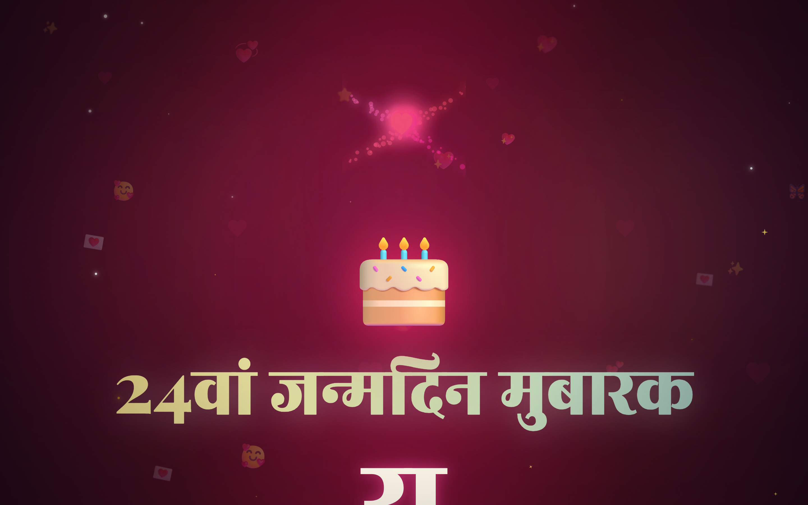
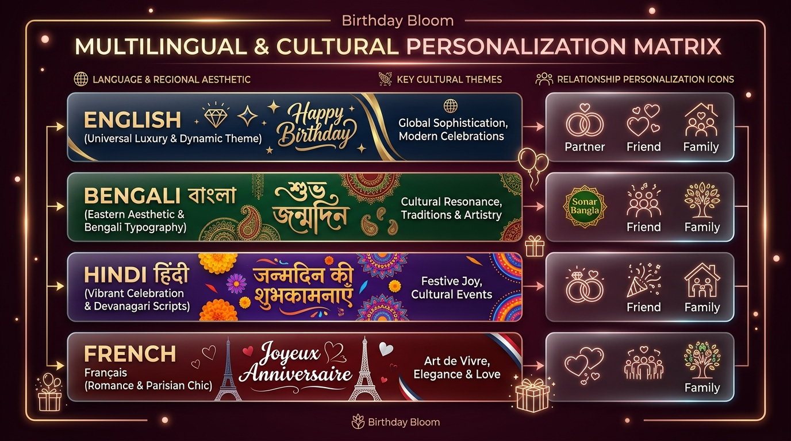

# 🌍 Multi-Language Localization Guide: Hindi (हिन्दी) Setup

[[DOCUMENTATION_INDEX|Back to Home]] | [[quick-start|Quick Start]] | [[setup-bengali|Bengali Setup]] | [[ENV_GUIDE|Env Customization Guide]] | [[architecture-env|Env Architecture]]


🌐 **Canonical Web Documentation**: [Hindi (हिंदी) Localization & Devanagari Typography](https://naborajs.me/projects/birthday-bloom/docs/setup-hindi)

Birthday Bloom features comprehensive **Hindi (हिन्दी) Multi-Language Localization** with deep emotional nuance, authentic cultural warmth, respectful Indic honorifics, and automated layout-safe text adaptations across every page and component.

---

## 🚀 Quick Setup (Enable Hindi)

To switch the entire website to Hindi, set `VITE_LANGUAGE` (or `VITE_LANG`) in your `.env.local` or hosting provider environment settings:

```env
VITE_LANGUAGE=hi
```

### Accepted Language Aliases
The reactive Zustand store and i18n dispatcher automatically normalize the following aliases to Hindi:
- `hi`
- `hindi`
- `in`

*(Case-insensitive and trimmed automatically)*

### ⚡ Instant URL Testing (Zero Setup)

Test the Hindi celebration experience immediately in your browser:
👉 [https://birthday-bloom.vercel.app/?phase=main&lang=hi&name=%E0%A4%B0%E0%A4%BE%E0%A4%B9%E0%A5%81%E0%A4%B2&age=24&rel=partner](https://birthday-bloom.vercel.app/?phase=main&lang=hi&name=%E0%A4%B0%E0%A4%BE%E0%A4%B9%E0%A5%81%E0%A4%B2&age=24&rel=partner)

<p align="center">
  
</p>



---

### Switching Between Locales
```env
# Switch to Hindi
VITE_LANGUAGE=hi

# Switch to Bengali
VITE_LANGUAGE=bn

# Switch to French
VITE_LANGUAGE=fr

# Switch to English (default)
VITE_LANGUAGE=en
```

> **Fallback Guarantee**: If `VITE_LANGUAGE` is omitted, misspelled, or set to an invalid locale, the application safely falls back to English (`en`) without throwing runtime exceptions or breaking key lookups.

---

## 🔤 Devanagari Typography & Conjuncts (संयुक्त अक्षर)

Hindi uses the Devanagari script, which contains complex ligature conjuncts (e.g. `क्ष`, `त्र`, `ज्ञ`, `श्र`) and halant (`्`) character combinations.
- **Grapheme Segmentation**: The `TypeWriter.tsx` component is engineered with `Intl.Segmenter` to advance characters by grapheme cluster, ensuring matras (मात्राएं) and half-letters (आधे अक्षर) do not flicker or detach during typewriter animations.
- **Font Stack**: Supported by `Noto Sans Devanagari` and `Rozha One` for elegant headings and high readability.

---

## 📦 What Changes in Hindi Mode?

When `VITE_LANGUAGE=hi` is active, the entire experience adapts to native Hindi:

### 1. Splash & Welcome Screen (`SplashScreen.tsx`)
- Tap prompt: *"सफर शुरू करने के लिए कहीं भी टैप करें ✨"*
- Headline: *"जन्मदिन का एक बेहद खास और जादुई तोहफा"*
- Subtext and start buttons adapt dynamically to create suspense and warmth.

### 2. Password Unlock Screen (`PasswordUnlock.tsx`)
- Unlock Header: *"पासवर्ड से अनलॉक करें 🔐"*
- Subtext: *"एक जादुई और बेहद खास जन्मदिन का तोहफा..."*
- Dynamic Date Hint: Automatically translates format hints to Hindi (e.g. `MMDD` $\rightarrow$ *"जन्मदिन का महीना और दिन (MMDD)"*).
- Form Validation & Security:
  - Input Placeholder: *"पासवर्ड दर्ज करें"*
  - Error Notification: *"गलत पासवर्ड! कृपया दोबारा प्रयास करें ✨"*
  - Unlock CTA Button: *"जादू खोलें ✨"*

### 3. Cinematic Storytelling & Fake Chat (`CinematicIntro.tsx`, `FakeChatScene.tsx`)
- **Storylines**: Dynamically selects culturally authentic Hindi poetic lines tailored to the recipient's relationship (`partner`, `friend`, `family`, `sibling`, etc.).
- **Fake Chat Simulation**:
  - Simulates active Hindi typing and backspacing:
    - Partner: *"मेरे दिल के राजा / रानी के लिए..."*
    - Friend: *"अरे रुको, सिर्फ एक साधारण संदेश? वो हम नहीं! 😂"*
    - Family: *"परिवार की जान और हमारी सबसे बड़ी खुशी..."*
- **Reveal Sequence**:
  - Dramatic title reveal: *"यह सिर्फ आपके लिए है..."*
  - Big celebratory banner: *"जन्मदिन मुबारक!"*

### 4. 3D Interactive Cake Cutting Ceremony (`CakeCutting.tsx`, `CakeTypes.ts`)
- **Preparation & Baking**:
  - Start CTA: *"काटना शुरू करें"*
  - Baking Screen: *"आपका केक तैयार हो रहा है..."*
  - Countdown: *"केक काटने के लिए तैयार हो जाइए..."*
- **Flavors**: Localized cake flavor names (*"शाही चॉकलेट डिलाइट"*, *"रसीली स्ट्रॉबेरी क्रीम"*, *"क्लासिक वेनिला ड्रीम"*).
- **Interactive Blowing Mechanic**:
  - Instruction: *"✨ एक प्यारी सी दुआ मांगें और मोमबत्ती बुझाएं ✨"*
  - Blow Button: *"🌬️ अभी फूंक मारें"*
  - Confirmation: *"दुआ आसमान के तारों तक पहुँच गई ✨"*
- **Celebration Quotes**: Heartfelt, poetic celebration wishes in Hindi.

### 5. Emotional Letters & Big Wishes (`SuperPersonalizedLogic.ts`, `hindiTemplates.ts`)
- **Nuanced Letter Generation**: Deeply personalized emotional letters generated via `HINDI_EMOTIONAL_LETTERS` based on gender, relationship, and interests.
- **Letter Title**: *"आपके लिए एक खास पत्र 💌"*
- **Sender Signoff**: Cleanly handles sender name replacement for `[आपका नाम]` / `[Your Name]` without duplicate or broken placeholders.
- **Big Wishes Cards**: High-impact Hindi celebration cards:
  - *"दिल से निकली ढेरों दुआएं"*
  - *"अपार सफलता, उत्तम स्वास्थ्य और खुशियां"*
  - Interest-specific cards for coding, gaming, music, art, cars, travel, and more.

### 6. Polaroid Photo Gallery & Video Memories (`PhotoGallery.tsx`, `VideoGallery.tsx`)
- **Gallery Title**: *"यादें 📸"*
- **Localized Captions**:
  - Partner: *"आपके साथ बिताया हर पल एक अनमोल तोहफा है 💖"*
  - Friend: *"सच्चे यार के साथ बिताए यादगार लम्हे 🚀"*
  - Family: *"परिवार का वो अनमोल साथ जो जिंदगी को खूबसूरत बनाता है ✨"*
- **Video Memories Section**: *"खास वीडियो यादें 🎬"* with full subtitle and title support.

### 7. Interactive Birthday Trivia Quiz (`BirthdayQuiz.tsx`)
- **Culturally Tailored Questions**: Hilarious, relatable, and culturally attuned trivia questions in Hindi.
- **Live Score Counters**: *"सवाल {{current}} / {{total}}"* and dynamic question tracking.
- **Results & Celebrations**:
  - High score: *"धमाकेदार स्कोर! 🏆"*
  - Replay CTA: *"फिर से खेलें 🔄"*

### 8. Growing Heart Tree (`HeartTree.tsx`)
- Clicking each interactive leaf reveals deep, poetic Hindi thoughts from `HINDI_SPECIAL_QUOTES` and `HINDI_HEART_MESSAGES`.
- Stage 4 completion text: *"प्यार और यादों का यह पेड़ हमेशा महकता रहेगा 🌸"*.

### 9. Final Surprise & Special Message (`FinalSurprise.tsx`, `SpecialMessage.tsx`)
- Memory cards, party hype badge (*"धमाकेदार मूड एक्टिवेटेड 💥"*), secret codes, and final video reveal adapt to natural Hindi phrasing.

---

## 👨‍👩‍👧‍👦 Relationship & Family Tone Nuances in Hindi

In Hindi culture, respect (*आदर / संस्कार*) and familial affection differ significantly across relationships. Birthday Bloom localizes every tone authentically:

| Relationship / Family Type | Tone & Honorifics in Hindi | Key Cultural Phrasing |
|---|---|---|
| **Elders** (`father`, `mother`, `grandfather`, `grandmother`) | Utmost respect (*सादर प्रणाम*, *आप*, *चरण स्पर्श*) | *"आपके आशीर्वाद से ही हमारा जीवन रोशन है..."*, *"संसार के सबसे प्यारे पापा / माँ"* |
| **Partner** (`partner`, `boyfriend`, `girlfriend`) | Deep romance, poetic tenderness (*मेरी जान*, *हमसफ़र*) | *"तुम मेरी जिंदगी का सबसे खूबसूरत अहसास हो..."*, *"हर सांस में तुम्हारी ही खुशी की दुआ है"* |
| **Siblings** (`brother`, `sister`, `sibling`) | Playful banter + protective warmth (*भाई*, *दीदी / बहना*, *तू / तुम*) | *"लड़ते-झगड़ते भी जान छिड़कने वाले भाई/बहन..."*, *"पार्टी कब दे रहा है? 😂"* |
| **Uncles & Aunts** (`uncle`, `aunt`) | Affectionate respect (*चाचाजी*, *मामाजी*, *मासीजी*, *बुआजी*) | *"परिवार की हर महफ़िल की शान..."*, *"आपके मार्गदर्शन के लिए दिल से धन्यवाद"* |
| **Friends** (`friend`, `bestie`) | Energetic, funny, brotherhood/sisterhood (*यार*, *जिगरी दोस्त*) | *"तू सिर्फ दोस्त नहीं, भाई है अपना!"*, *"जिंदगी भर की यादों और मस्ती के नाम"* |
| **Mentors & Colleagues** (`mentor`, `colleague`) | Professional warmth & deep gratitude (*आदरणीय गुरुवर / साथी*) | *"आपके मार्गदर्शन ने हमारे रास्ते आसान बनाए हैं..."*, *"कामयाबी की नई ऊंचाइयों को छुएं"* |

---

## 🔤 Indic Typography & Responsive Layout Protections

Hindi (Devanagari script) features horizontal headline bars (*shirorekha*), complex conjunct characters (*samyuktaksar* e.g., `क्ष`, `त्र`, `ज्ञ`), and vowel marks (*matras*). Birthday Bloom implements specialized CSS and runtime protections:

### 1. Google Fonts Hierarchy
Imported in `src/index.css`:
```css
@import url('https://fonts.googleapis.com/css2?family=Noto+Sans+Devanagari:wght@400;500;600;700;900&family=Rozha+One&family=Hind+Siliguri:wght@400;500;600;700&display=swap');
```
- **Display & Headings**: `Rozha One`, `Playfair Display`, `Noto Sans Devanagari`
- **Body & UI**: `Noto Sans Devanagari`, `Hind`, sans-serif

### 2. Shirorekha & Conjunct Continuity Reset
In `src/index.css`:
```css
/* Indic typography protection: preserve shirorekha & conjunct continuity */
html[lang="hi"] * {
  letter-spacing: normal !important;
  text-transform: none !important;
}
```
> **Why this matters**: Adding letter-spacing or uppercase transformation to Devanagari breaks the continuous top line (*shirorekha*) and separates vowel matras from base consonants. Our global reset guarantees pristine typography.

### 3. Grapheme-Aware Kinetic Typography
In `KineticText.tsx` and `TypeWriter.tsx`, text is split along grapheme clusters and word boundaries rather than raw byte strings, ensuring that dependent matras (like `ि`, `ी`, `ु`, `ू`, `े`, `ै`, `ो`, `ौ`, `्`) stay glued to their parent consonants during animated reveals.

---

## 🛠️ Developer & i18n Architecture

The localization engine is modular and strongly typed:

### Translation Hook Usage
```tsx
import { useTranslation } from "@/i18n";

export const BirthdayHeader = () => {
    const { t, language, isHindi, isBengali } = useTranslation();

    return (
        <div>
            <h1>{t('common.happyBirthday')}</h1>
            <p>{t('common.dear', { name: 'रोहन' })}</p>
            {isHindi && <span className="text-xs text-primary">हिन्दी मोड सक्रिय</span>}
        </div>
    );
};
```

### Parameter Interpolation
Interpolation handles variables smoothly:
```ts
t('quiz.questionProgress', { current: 1, total: 5 });
// Hindi Output: "सवाल 1 / 5"
```

### Key Source Files
- `src/i18n/types.ts`: `TranslationSchema` interface definition.
- `src/i18n/index.ts`: Translation dispatcher, alias normalization, and fallback logic.
- `src/i18n/locales/hi.ts`: Exhaustive Hindi translation dictionary.
- `src/config/hindiTemplates.ts`: Hindi letters, big wishes, and tree quotes.
- `src/features/core/store/SuperPersonalizedLogic.ts`: Personalized narrative routing for Hindi.

---

## 📋 Sample Hindi `.env.local` Recipe

```env
# Core Identity & Language
VITE_LANGUAGE=hi
VITE_BIRTHDAY_NAME="राहुल"
VITE_BIRTHDAY_AGE=25
VITE_BIRTHDAY_GENDER=male
VITE_BIRTHDAY_RELATIONSHIP=friend
VITE_BIRTHDAY_COLOR=#FF6B6B
VITE_BIRTHDAY_WISHER_NAME="अमित"

# Interactive Customization
VITE_BIRTHDAY_INTERESTS=gaming,music,coding
VITE_BIRTHDAY_CUSTOM_MESSAGE="जन्मदिन की ढेर सारी शुभकामनाएं मेरे भाई! जीवन में हमेशा मुस्कुराते रहो।"
VITE_SHOW_CAKE_SECTION=true
VITE_SHOW_PHOTO_SECTION=true
VITE_SHOW_QUIZ_SECTION=true
VITE_SHOW_HEART_TREE_SECTION=true
VITE_ANIMATION_INTENSITY=high
```

---

## 🧪 Verification & Testing

Run the test suite to verify Hindi localization, string interpolation, and build integrity:

```bash
# Run Vitest unit tests
npm run test

# TypeScript typecheck
npx tsc --noEmit

# ESLint audit
npm run lint

# Production build
npm run build
```

---

#obsidian #documentation #birthday-bloom #hindi #localization #i18n #devanagari

---

## 🔍 Scope Boundaries

### What is Present:
- Devanagari Font Loading (Google Noto Sans Devanagari), Shirorekha Protections, Culturally Authentic Micro-copy.

### What is NOT Present:
- Bengali or French linguistic rules (see [[setup-bengali|Bengali]], [[setup-french|French]]), WebGL shadow map filter algorithms (see [[Birthday-Components#Procedural-Lighting-and-Contact-Shadows|Birthday Components]]).
